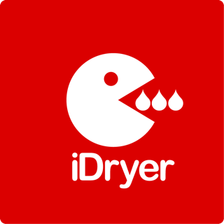

# Build Your Own iDryer

**Своё устройство на ESP32. Портал, приложение, push: всё готово, пишете только логику.**

   

---

## Что это

Набор сквозных примеров и учебник к ним. Каждый пример — законченное устройство на библиотеке `idryer-core`, доведённое до рабочего состояния и подключённое к [порталу iDryer](https://portal.idryer.org/).

Собрав устройство на ядре, вы сразу получаете всю инфраструктуру: портал, авторизацию, привязку, защищённую связь, телеметрию, графики, обновление по воздуху. Ничего из этого писать не нужно.

## Для кого

- **Вы разработчик и вам нужен портал, а не бэкенд.** Есть идея устройства, есть ESP32, нет желания писать сервер, авторизацию и мобильное приложение. Ядро даёт всё это готовым.
- **Вы собираете первое устройство.** Электроника пока незнакома, но хочется не повторить чужую схему, а понять, что и почему подключается. Учебник ведёт от расчёта тока до рабочей прошивки.
- **Вам нужно устройство, которого нет.** Увлажнитель, вытяжка, монитор склада. Экосистема не ограничивает список: объявили датчики, устройство в портале.

## Что пишете вы, а что делает ядро

Вы пишете только то, что специфично вашему устройству: чтение датчиков, управление нагрузкой, логику работы. Это сотни строк, а не тысячи — в готовом примере шкафа основной файл занимает **125 строк**.

Всё остальное берёт на себя `idryer-core`: подключение к Wi-Fi, привязка к аккаунту, защищённая MQTT-сессия, публикация телеметрии, приём команд, обновления. Сетевой стек вам писать не придётся вообще.

## Устройство само появляется в портале

Здесь главное отличие от обычного «сделай сам».

Вы объявляете в прошивке, какие у устройства есть датчики и органы управления — одной-двумя строками на каждый. Портал строит карточку по этому описанию сам: живые показания, кнопки, поля ввода.

Ни строчки кода на стороне портала. Ни согласований, ни pull request'ов. Устройства, которого в экосистеме iDryer никогда не было, — увлажнитель, станция обдува, контроллер вытяжки, монитор склада — получают рабочий интерфейс.

> Автоматическая карточка сейчас работает в веб-портале. В мобильном приложении тот же рендер запланирован, но пока не сделан.

→ [Как это делается в коде](https://docs.idryer.org/development/byod/10-build-a-filter/06-card/)

## Готовые примеры

### Шкаф хранения филамента

Закрытый шкаф на 10–40 катушек с мягким теплом 40–45 °C, которое держит филамент сухим. Один ESP32 делает всё: читает климат, управляет нагревателем и вентилятором, держит связь с порталом.

Пример проходит весь путь — концепция, комплектация, схема подключения, первая прошивка, датчики, меню, управление нагревом, сборка и проверка.

→ [Собрать шкаф](https://docs.idryer.org/development/byod/09-build-a-device/01-concept/)

### Умный фильтр воздуха

Коробка с вентилятором, HEPA-фильтром и угольным слоем. Меряет качество воздуха датчиком VOC, сам включается, когда воздух грязный, и выключается, когда очистился. С портала выбирается режим и порог срабатывания.

ABS и ASA при печати пахнут стиролом, смолы — своим букетом. Фильтр рядом с принтером это не роскошь, а гигиена.

Этот пример показывает главное: устройство, которого в экосистеме нет вообще, получает полноценную карточку в портале.

→ [Собрать фильтр](https://docs.idryer.org/development/byod/10-build-a-filter/01-concept/)

## Если электроника пока незнакома

Примерам предшествует полноценный курс — от первого расчёта тока до рабочего устройства. Он не заменяет электрика и не учит схемотехнике, но проводит через всё, что нужно для сборки.

| Раздел | О чём |
|---|---|
| Основы электроники | Питание, ток, нагрузка, MOSFET, симистор, твердотельное реле |
| Контроллеры | ESP32, Arduino, RP2040, STM32, интерфейсы, прошивка |
| Компоненты | Нагреватели, вентиляторы, термисторы, серво, тензодатчики, экраны, RFID |
| Теплофизика и материалы | Теплопроводность, конвекция, безопасность материалов |
| Инструменты | Мультиметр, USB-UART, паяльник, обжим, ST-Link, осциллограф |
| Практика | Подключение вентилятора, проверка термистора и остальные операции по шагам |
| 3D-печать | Какие детали переживут соседство с нагревом |
| Типовые ошибки | Куда смотреть, если не включается, греется или ведёт себя странно |

Читать можно по порядку, а можно открывать как справочник.

→ [С чего начать](https://docs.idryer.org/development/byod/00-start-here/01-introduction/) · [Типовые ошибки](https://docs.idryer.org/development/byod/08-common-mistakes/01-overview/)

## Примеры пополняются

Это открытый набор. Собрали своё устройство на ядре — присылайте пример, он встанет рядом с остальными.

Полезен и разбор неудач: что не завелось, где обожглись, какой компонент оказался не тем. Такие истории экономят другим недели.

## Статус

Учебник развивается: главы дописываются, примеры пополняются. Шкаф хранения собран и живёт в портале, фильтр воздуха разобран по шагам в документации.

## Безопасность

> **Устройства из этого раздела греются и питаются от сети.** Работа с `110–230 В` требует отдельной дисциплины и не прощает спешки. Прежде чем включать что-либо собранное своими руками, прочитайте разделы про безопасность целиком.

Документация не заменяет электрика и не даёт разрешения собирать опасные устройства без понимания того, что вы делаете.

## Место в экосистеме

| Слой | Что делает | Репозиторий |
|---|---|---|
| Учебник и примеры | Как собрать своё устройство — **этот репозиторий** | Build-Your-Own-iDryer |
| Ядро | Библиотека: сеть, портал, протокол, телеметрия | [idryer-core](https://github.com/pavluchenkor/idryer-core) |
| Серийный контроллер | Готовое решение для сушилок | [iDryerControllerV2](https://github.com/pavluchenkor/iDryerControllerV2) |
| Облако | Портал, приложение, авторизация | [portal.idryer.org](https://portal.idryer.org/) |

## Что лежит в репозитории

| Путь | Что это |
|---|---|
| `example/` | Рабочие проекты примеров, готовые к сборке |

## Лицензия

Документация — [CC BY 4.0](LICENSE-Documentation.txt). Исходный код, включая примеры, — [Apache License 2.0](LICENSE-Software.txt). Подробности в [LICENSE.txt](LICENSE.txt) и [NOTICE](NOTICE).

Имя iDryer лицензией не покрывается — [TRADEMARKS.md](https://github.com/pavluchenkor/idryer-core/blob/main/TRADEMARKS.md).

## Помощь

- [Telegram](https://t.me/iDryer)
- [Discord](https://discord.gg/jGce5eeHHz)
- [Документация](https://docs.idryer.org/development/byod/)

Инструкции и разборы на канале: [YouTube](https://www.youtube.com/@iDryerProject) · [Rutube](https://rutube.ru/channel/34401569/)

## Участие

Присылайте свои примеры, дополняйте учебник, исправляйте ошибки — заводите issue или pull request.

## Дальше

[Соберите фильтр воздуха](https://docs.idryer.org/development/byod/10-build-a-filter/01-concept/): самый короткий путь от идеи до работающего устройства.
