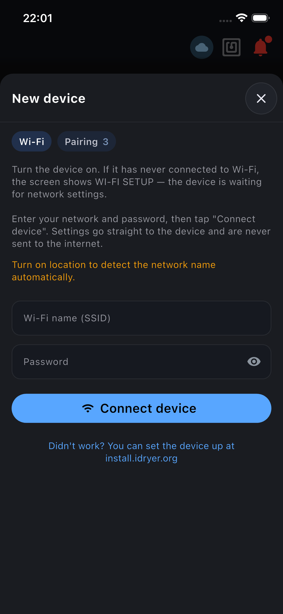
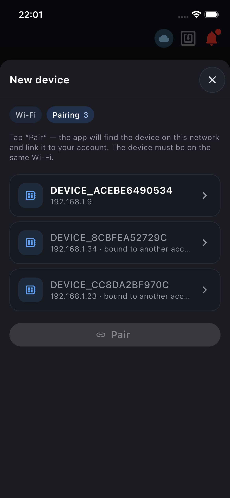
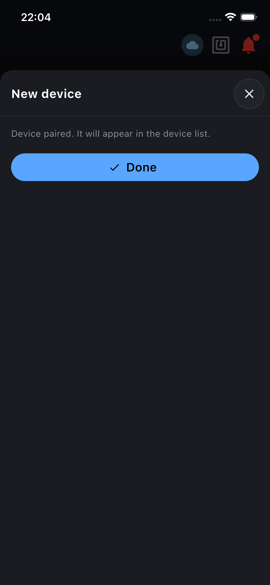
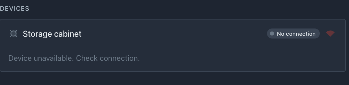

# Firmware-Start auf dem Kern

Auf dieser Seite erstellen Sie ein Firmware-Projekt, bringen den ESP32 in den Online-Status auf dem Portal und prüfen, dass der Netzwerk-Teil funktioniert. Sensoren und Heizlogik werden in den nächsten Schritten hinzugefügt.

Der Ansatz basiert auf der Fassade `iDryer::Link`. Sie beschreiben das Gerät mit einer einzigen Struktur `iDryer::Config`, rufen `link.begin()` und `link.loop()` auf — der Kern kümmert sich selbst um die gesamte Netzwerkverbindung.

## 1. Bereiten Sie die Tools vor

Sie benötigen:

- VS Code mit PlatformIO-Erweiterung;
- USB-Kabel;
- Wi-Fi-Netzwerk `2.4 GHz` (ESP32 funktioniert nicht mit reinen `5 GHz`-Netzwerken);
- ein Smartphone mit der iDryer-App ([App Store](https://apps.apple.com/app/idryer/id6760609044), [Google Play](https://play.google.com/store/apps/details?id=org.idryer.mobile)), angemeldet mit Ihrem iDryer-Portalkonto: darüber bekommt das Gerät das WLAN und wird mit dem Konto gekoppelt;
- die Kern-Bibliothek [idryer-core](https://github.com/pavluchenkor/idryer-core);
- das fertige Projekt dieses Kapitels — [example/09-cabinet](https://github.com/pavluchenkor/Build-Your-Own-iDryer/tree/main/example/09-cabinet) im Repository des Handbuchs: daher stammen der Sensortreiber und weitere Dateien, die weiter unten zum Kopieren vorgeschlagen werden.

Was eine Controller-Firmware ist und wie sie auf die Platine gelangt — [Controller-Firmware](../02-controllers/11-flashing-controller.md).

## 2. Erstellen Sie ein Projekt

In PlatformIO ist ein Projekt ein Ordner mit einer festen Struktur. Erstellen Sie einen Projektordner (z. B. `my-cabinet`) und öffnen Sie ihn in VS Code. Darin sollten sich diese Dateien befinden:

```text
my-cabinet/
├── platformio.ini        # Buildeinstellungen (wird in Schritt 4 ausgefüllt)
├── lib/
│   └── idryer-core/      # Kern-Bibliothek (Symlink oder Kopie)
└── src/
    └── main.cpp          # Gerätecode: Config + setup() + loop()
```

Alle unten stehenden Code-Fragmente gehen in diese Dateien — jeder Schritt gibt an, in welche. Erstellen Sie die Ordner `include/`, `lib/` und `src/` manuell, wenn sie nicht vorhanden sind.

Legen Sie die Bibliothek `idryer-core` in `lib/` — PlatformIO findet Bibliotheken dort automatisch. Das Einfachste ist, einen Symlink zur heruntergeladenen Bibliothek zu erstellen:

```bash
git clone https://github.com/pavluchenkor/idryer-core.git ~/idryer-core
ln -s ~/idryer-core lib/idryer-core
```

Statt eines Symlinks können Sie den Ordner der Bibliothek einfach nach `lib/idryer-core` kopieren — das funktioniert genauso.

Dies ist auch für die Menü-Generierung erforderlich (Kapitel 6) — der Hook sucht den Generator im `lib/idryer-core/`-Verzeichnis.

## 3. WLAN und Kopplung stehen nicht im Code

Die Firmware enthält weder das WLAN-Passwort noch Kontodaten. Beim ersten Start hat das Gerät kein WLAN und wartet auf Einstellungen: die iDryer-App sendet sie per Funk (ESPTouch) und koppelt das Gerät dann mit einem einmaligen Kopplungstoken an Ihr Konto. Der Core erledigt das alles in `s_link.begin()` und `s_link.loop()`, Sie gehen nur die Schritte in der App durch — Abschnitt 9.

**Wie das Netzwerk ins Gerät gelangt.** Eine Platine ohne gespeichertes Netzwerk hört den Äther ab wie ein Empfänger, der auf keinen Sender eingestellt ist. Das Telefon „klopft" in dieser Zeit den Netzwerknamen und das Passwort in die Luft — ungefähr wie mit dem Morsealphabet, nur mit Wi-Fi-Paketen. Die Platine fängt diese Übertragung auf, verbindet sich mit dem Netzwerk und geht danach bei jedem Einschalten selbst hinein. Eigene Pins und Leitungen sind dafür nicht nötig: es arbeitet die reguläre Antenne der Platine, es startet von selbst, solange kein Netzwerk vorhanden ist, und dauert bis zu 90 Sekunden.

Wenn es per Funk nicht klappt, gibt es den Weg über Kabel: der Web-Installer [install.idryer.org](https://install.idryer.org) übergibt der Platine Netzwerk und Kopplungstoken über USB — dasselbe, was die App tut, nur per Kabel. Es hilft auch ein normaler Neustart der Platine: danach wartet sie wieder auf Einstellungen.

## 4. Konfigurieren Sie platformio.ini

Füllen Sie `platformio.ini` im Projektverzeichnis aus:

```ini
[env:cabinet]
platform    = espressif32
framework   = arduino
board       = esp32-c3-devkitm-1

; Die Bibliotheken des Cores (MQTT, ArduinoJson, WebSockets, Improv) kommen
; von selbst aus lib/idryer-core/library.json.
; ESPAsyncTCP ist der ESP8266-Transport aus den Abhängigkeiten von espMqttClient:
; auf dem ESP32 baut er nicht und muss ausgeschlossen werden.
lib_ignore = ESPAsyncTCP

build_flags =
    -DIDRYER_API_BASE='"https://portal.idryer.org/api"'
    -DMQTT_BROKER='"mqtt.idryer.org"'
    -DMQTT_PORT=8883
    -DMQTT_USE_TLS=1
```

Ersetzen Sie `board` durch Ihre Platine (z. B. `esp32-s3-devkitc-1`). Sie müssen `idryer-core` nicht in `lib_deps` angeben — sie liegt in `lib/` (Schritt 2).

!!! note "Was diese Zeilen tun"
    Die Abhängigkeiten des Cores listen Sie nicht auf: PlatformIO holt sie aus `lib/idryer-core/library.json`. `lib_ignore = ESPAsyncTCP` ist Pflicht — ohne diese Zeile bricht der Build in `ESPAsyncTCP.cpp` ab. Die Flags `MQTT_BROKER` und `MQTT_PORT` sind ebenfalls Pflicht — ohne sie kompiliert der Core nicht (`'MQTT_BROKER' was not declared`).

## 5. Beschreiben Sie das Gerät in Config

Alles Weitere geschieht in einer Datei — `src/main.cpp`. Öffnen Sie sie und schreiben Sie den Code aus diesem und den folgenden Schritten.

`iDryer::Config` ist der Datenblatt des Geräts. Die Flags `has*` teilen dem Portal mit, was das Gerät hat, und bestimmen, welche Telemetrie-Felder veröffentlicht werden.

Für einen beheizten Schrank am Anfang von `src/main.cpp`

```cpp
#include <iDryer.h>

static const iDryer::Config CFG = {
    .deviceType        = iDryer::DeviceType::Unknown,   // eigenes Gerät: die Karte baut das Manifest
    .unitsCount        = 1,
    .telemetryPeriodMs = 5000,
    .statusPeriodMs    = 10000,
    .hardwareVersion   = "1.0",
    .firmwareVersion   = "0.1.0",
    .model             = "DIY Storage Cabinet",
};

static iDryer::Link s_link(CFG);
```

!!! note "Die Flags has* sind ein Vertrag mit dem Portal"
    Ein Telemetrie-Feld, dessen entsprechendes Flag `false` ist, wird nicht veröffentlicht. Beispielsweise wird die Luftfeuchtigkeit ohne `hasAirHumidity = true` nicht in die Cloud gelangen, auch wenn Sie sie in den Code schreiben. Aktivieren Sie nur das, was physisch im Gerät vorhanden ist.

Die Liste der Komponenten und Flags finden Sie unter [Systemzusammensetzung](02-bom.md).

## 6. Minimale Hauptfunktion

Fügen Sie in derselben Datei nach dem `Config`-Block die Funktionen `setup()` und `loop()` hinzu. Für den ersten Start reicht es aus, den Link zu initialisieren und ihn in `loop()` zu drehen:

```cpp
void setup() {
    Serial.begin(115200);
    s_link.begin();
    // Gerät im Portal entkoppelt: Geheimnis löschen, auf neue Kopplung warten.
    s_link.onCommand("revoke", [](JsonObjectConst) { s_link.handleRevoke(); });
}

void loop() {
    s_link.loop();
}
```

`s_link.begin()` startet WLAN, Kopplung und die Verbindung zum Portal. Der Befehl `revoke` kommt vom Portal, wenn das Gerät vom Konto entkoppelt wird: `handleRevoke()` löscht das Geheimnis des Geräts, und es wartet auf eine neue Kopplung. Sensoren kommen im Schritt [Sensoren](05-sensors.md) dazu.

### Vollständiger `src/main.cpp` nach diesem Kapitel

Nehmen Sie beide Blöcke von oben in eine Datei — das ist die gesamte `src/main.cpp` bei diesem Schritt:

```cpp
#include <iDryer.h>

static const iDryer::Config CFG = {
    .deviceType        = iDryer::DeviceType::Unknown,   // eigenes Gerät: die Karte baut das Manifest
    .unitsCount        = 1,
    .telemetryPeriodMs = 5000,
    .statusPeriodMs    = 10000,
    .hardwareVersion   = "1.0",
    .firmwareVersion   = "0.1.0",
    .model             = "DIY Storage Cabinet",
};
static iDryer::Link s_link(CFG);

void setup() {
    Serial.begin(115200);
    s_link.begin();
    // Gerät im Portal entkoppelt: Geheimnis löschen, auf neue Kopplung warten.
    s_link.onCommand("revoke", [](JsonObjectConst) { s_link.handleRevoke(); });
}

void loop() {
    s_link.loop();
}
```

Das vorherige Kapitel zeigt, **was hinzugefügt werden soll** und den **vollständigen `src/main.cpp` nach den Änderungen**, damit Sie immer das große Ganze sehen, nicht verstreute Fragmente.

## 7. Flashen Sie

```bash
pio run -e cabinet -t upload
```

## 8. Öffnen Sie Serial Monitor

```bash
pio device monitor -b 115200
```

Solange das Gerät kein WLAN hat, bleibt das Log still: der Core hält die serielle Schnittstelle für den Web-Installer (Improv) frei. Die Logs schalten sich ein, sobald das WLAN steht. Bei einem noch nicht gekoppelten Gerät endet das Log so:

```text
[BOOT] WiFi ok, logs enabled
[INFO ] CLOUD: WiFi connected, IP: 192.168.1.42, RSSI: -55 dBm, …
…
[INFO ] CLOUD: binding-v3: no secret — awaiting pairing token (SETUP)
```

Die letzte Zeile ist genau das, was in diesem Schritt gebraucht wird: das Netzwerk steht, ein Kopplungsgeheimnis gibt es nicht, das Gerät wartet auf das Token aus der App. Lassen Sie den Monitor offen und wechseln Sie zur App.

## 9. WLAN verbinden und Gerät in der App koppeln

1. Verbinden Sie das Telefon mit dem WLAN, in dem das Gerät arbeiten soll (`2.4 GHz`), und melden Sie sich in der iDryer-App mit Ihrem Portalkonto an.
2. Tippen Sie auf dem Startbildschirm auf **Neues Gerät verbinden** — der Schritt **WLAN** öffnet sich.
3. Prüfen Sie den Netzwerknamen (die App trägt ihn selbst ein, wenn der Standortzugriff an ist), geben Sie das Passwort ein und tippen Sie auf **Gerät verbinden**. Die App sendet die Einstellungen bis zu 90 Sekunden lang; sobald das Gerät im Netz ist, erscheint **Gerät verbunden**. Tippen Sie auf **Weiter**.
4. Tippen Sie im Schritt **Kopplung** auf **Koppeln**. Die App findet das Gerät im Netz, holt beim Portal ein einmaliges Kopplungstoken, übergibt es dem Gerät und wartet, bis das Portal bestätigt, dass das Gerät online ist.
5. Nach **Gerät gekoppelt** erscheint das Gerät in der Geräteliste im Portal und in der App.

Ist das Gerät schon im Netz, öffnen Sie gleich den Schritt **Kopplung** — tippen Sie oben im Fenster auf seinen Chip.


*Schritt **WLAN**: die App überträgt das Netzwerk per Funk an das Gerät.*


*Schritt **Kopplung**: die App hat das Gerät anhand seiner Seriennummer im Netz gefunden. Fremde Geräte sind als belegt markiert.*


*Fertig: das Gerät ist mit dem Konto gekoppelt und erscheint gleich in der Liste.*

Im Log ist die Kopplung zu sehen:

```text
[INFO ] CLOUD: binding-v3: pairing token received (… chars)
[INFO ] CLOUD: binding-v3: activating with pairing token (serial=DEVICE_… mcu=-)
[INFO ] CLOUD: binding-v3: activated, deviceId=… -> Ready
…
[INFO ] MQTT: Connected! …
```

## Überprüfung des Ergebnisses

In diesem Stadium sollte das Gerät im Portal Online sein. Sensordaten gibt es noch keine — das ist erwartet: `Config` hat noch nichts über sie deklariert, und die Karte hat nichts zu zeigen.


*Das Gerät im Portal: Name, Zustand Idle, Verbindungssymbol. Messwerte gibt es keine — sie erscheinen im nächsten Kapitel.*

Der Name `Device DEVICE_…` ist der Werksname. Benennen Sie das Gerät über das Stiftsymbol neben dem Namen um: in den weiteren Beispielen heißt es „Storage cabinet".

Wenn etwas schiefging:

- die App hat nicht gesehen, dass das Gerät ins Netz kam — prüfen Sie das Passwort und dass das Netz `2.4 GHz` ist; bei falschem Passwort wartet das Gerät wieder auf Einstellungen, starten Sie die Platine neu und wiederholen Sie den Schritt WLAN;
- das Netzwerk wird per Funk gar nicht übertragen — machen Sie dasselbe per USB über den Web-Installer [install.idryer.org](https://install.idryer.org);
- im Schritt **Kopplung** hat die App das Gerät nicht gefunden — Telefon und Gerät müssen im selben Netz sein, und das Netz darf die Geräteerkennung nicht blockieren (Gastnetze tun das oft);
- das Gerät startet neu — prüfen Sie die Stromversorgung des ESP32 (Spannungseinbrüche beim Start sind eine häufige Ursache für Resets);
- der Build bricht mit einem Fehler ab — fragen Sie in der Community: [Telegram](https://t.me/iDryer), [Discord](https://discord.gg/jGce5eeHHz);
- siehe [Stromversorgungsfehler](../08-common-mistakes/02-power-mistakes.md) und [Controller-Fehler](../08-common-mistakes/04-controller-mistakes.md).

## Was kommt als Nächstes

Der Netzwerk-Teil funktioniert. Gehen Sie zu [Sensoren](05-sensors.md): Wir verbinden SHT31 und Thermistor und sehen deren Daten auf dem Portal.
