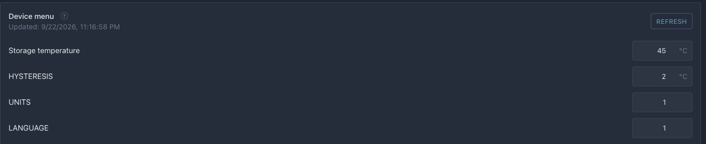

# Menú desde YAML

El menú es un conjunto de parámetros del dispositivo: temperatura objetivo, histéresis, umbrales de ventilador. En `idryer-core` el menú se describe en un único archivo `menu.yaml`, y todo lo demás — estructuras C++, almacenamiento en memoria no volátil (NVS) y publicación en el portal — se genera automáticamente.

Este es uno de los componentes clave del núcleo. No escribe código de almacenamiento de parámetros ni inventa un formato para el portal — solo enumera los parámetros en YAML.

## Por qué el menú

Después de los pasos anteriores, el dispositivo lee sensores, pero todos los umbrales están «codificados» en el código. El menú resuelve tres problemas a la vez:

- **almacenamiento**: los valores persisten después del reinicio (NVS);
- **gestión desde el portal**: el portal muestra cada elemento del menú según su tipo (número, interruptor);
- **única fuente de verdad**: un archivo describe tanto la memoria como la interfaz.

## Cómo funciona

Un archivo `menu.yaml` pasa por un generador durante la compilación:

```text
menu.yaml → (pio run build) → archivos C++ en src/menu/ + NVS + JSON para el portal
```

El portal dibuja cada elemento del menú según su tipo. `role:` da al elemento una etiqueta traducida del contrato del núcleo; un elemento sin `role:` se muestra con su `title`.

!!! warning "No edite los archivos generados"
    Los archivos `menu_state.*`, `menu_bindings.*`, `menu_ids.h` y otros los crea el generador. Edite solo `menu.yaml` y recompile — de lo contrario sus cambios se perderán.

    El nombre de la constante de un elemento se forma de manera simple: `MENU_` más su `id` en mayúsculas. El elemento `target_temp` da `MENU_TARGET_TEMP`, `hysteresis` — `MENU_HYSTERESIS`. Estas constantes harán falta en el capítulo 7.

## Paso 1. Copie la plantilla

La biblioteca contiene una plantilla de menú. Cópiela en su proyecto:

```bash
mkdir -p src/menu
cp path/to/idryer-core/menu/menu.template.yaml src/menu/menu.yaml
```

## Paso 2. Habilite la generación durante la compilación

Copie el gancho de ejemplo del proyecto `iDryer-Storage` (puede usarlo tal cual, no necesita cambios):

```bash
mkdir -p extra_scripts
cp path/to/iDryer-Storage/extra_scripts/pre_gen_menu.py extra_scripts/pre_gen_menu.py
```

Luego en `platformio.ini` agregue `-Isrc/menu` en la sección `[env:cabinet]` (para que el código vea `#include <menu_state.h>`) y conecte el gancho mediante `extra_scripts`:

```ini
[env:cabinet]
; ... platform / board / lib_deps del capítulo 4 — sin cambios ...

build_flags =
    -Isrc/menu                      ; ← agregado: ruta al menú generado
    -DIDRYER_API_BASE='"https://portal.idryer.org/api"'
    -DMQTT_BROKER='"mqtt.idryer.org"'
    -DMQTT_PORT=8883
    -DMQTT_USE_TLS=1

extra_scripts =                     ; ← agregado
    pre:extra_scripts/pre_gen_menu.py
```

El gancho encontrará automáticamente el generador en la ruta `lib/idryer-core/menu/menu_gen.py`, por lo que la biblioteca debe estar conectada mediante `lib/` (enlace simbólico o copia), como se describe en el capítulo 4. PlatformIO ejecuta el generador con su propio Python — no hay que instalar nada aparte. Si aun así la compilación falla en este paso, muestre el texto del error en la comunidad: [Telegram](https://t.me/iDryer), [Discord](https://discord.gg/jGce5eeHHz).

## Paso 3. Describa los parámetros del gabinete

Abra `src/menu/menu.yaml`. La plantilla ya tiene un elemento raíz `root` con un arreglo `children` y parámetros de ejemplo. Elimine los ejemplos (`my_param`, `my_flag`, `my_mode_group`) y agregue los suyos dentro de `children`. Los dos últimos elementos — `units_count` e `language` — déjelos en su lugar: este es un contrato fijo con el portal.

Para un gabinete básico, basta con unos pocos parámetros.

Temperatura objetivo de almacenamiento:

```yaml
- id: target_temp
  type: value
  role: storage.target_temperature   # etiqueta del contrato del núcleo
  title: { ru: "ТЕМПЕРАТУРА", en: "TARGET TEMP" }
  unit:  { ru: "°C", en: "°C" }
  vtype: uint16
  min: 30
  max: 50
  step: 1
  bind: target_temp            # clave NVS (≤ 15 caracteres)
  persist: true
  scope: global
  default: 45
```

Histéresis (cuántos grados puede bajar la temperatura por debajo del objetivo antes de que se encienda el calentador nuevamente):

```yaml
- id: hysteresis
  type: value
  title: { ru: "ГИСТЕРЕЗИС", en: "HYSTERESIS" }
  unit:  { ru: "°C", en: "°C" }
  vtype: uint8
  min: 1
  max: 5
  step: 1
  bind: hysteresis
  persist: true
  scope: global
  default: 2
```

!!! note "role: — es una lista cerrada"
    El valor `role:` no puede ser arbitrario — debe estar en la lista `canonical_roles` del contrato del núcleo. Si no hay un rol adecuado, la compilación se detiene y muestra la lista de roles permitidos. Para un gabinete de almacenamiento, los roles de la familia `storage.*` son apropiados: `storage.target_temperature`, `storage.target_humidity`, `storage.start`, `storage.stop`. La lista completa está en el encabezado de `menu.template.yaml`. `role:` es opcional: un parámetro sin él (como la histéresis anterior) se guarda y se publica igual, solo que su etiqueta sale de `title`.

Restricciones que no se pueden violar:

- `bind` — no más de 15 caracteres (límite de clave NVS);
- no añadas el campo `widget:` a `menu.yaml`: ni el portal ni la aplicación lo leen; un elemento del menú se dibuja según su tipo.

!!! warning "Verifique el elemento ignore_external_cmd de la plantilla"
    La plantilla contiene un elemento `ignore_external_cmd`, y su `bind` tiene 19 caracteres, lo que excede el límite de 15. Si lo deja así, la generación fallará: `bind 'ignore_external_cmd' ... tiene 19 caracteres, límite 15`. Elimine este elemento o acorte `bind` a `ign_ext_cmd` (como en los productos reales). Para un gabinete básico, puede simplemente eliminarlo.

## Paso 4. Compile el proyecto y verifique la generación

```bash
pio run -e cabinet
```

Durante la compilación, el pre-hook instalará automáticamente las dependencias (una sola vez) y generará los archivos C++ del menú. Si `menu.yaml` no cambió — la generación se omite (`up-to-date`).

Verifique que la generación se haya completado. En el registro de compilación aparece una línea sobre la generación del menú, y en la carpeta `src/menu/` — los archivos generados:

```text
src/menu/
├── menu.yaml          # su archivo (fuente)
├── menu_state.h/.cpp  # objeto menu con todos los parámetros
├── menu_bindings.*    # acceso por bind + escritura en NVS
├── menu_ids.h
└── menu_meta.h        # y otros
```

Si la compilación falla con un mensaje sobre un `role:` desconocido — significa que el rol no está en la lista `canonical_roles`. Corrija el rol y recompile. No edite manualmente los archivos marcados como autogen.

## Paso 5. Carga el menú al arrancar

Conecta el menú generado en `src/main.cpp` y cárgalo en `setup()`, **antes** de `s_link.begin()`:

```cpp
#include <menu_state.h>      // objeto menu con todos los parámetros
#include <menu_bindings.h>   // menu_sync_state_to_cache, menu_apply_by_bind

menu.initDefaults();         // establecer valores por defecto de YAML
menu.loadFromNVS();          // valores guardados; en el primer arranque se guardan los valores por defecto
menu_sync_state_to_cache();  // valores a la caché de la que se construye el menú publicado
```

Después, los parámetros están disponibles a través del objeto global `menu`:

```cpp
uint16_t target = menu.target_temp;   // acceso directo al valor
```

## Paso 6. El menú en el portal: publicar y aceptar cambios

El portal no lee el menú del dispositivo por sí mismo: el firmware lo publica y aplica los cambios que vuelven. Tres partes:

- **publicar**: `menu_buildFullJson()` del core construye el JSON del menú a partir de `menu.yaml` y los valores actuales; `devicePublisher()->publishConfigRaw()` lo envía al portal (topic MQTT `config`) y a la aplicación por la red local;
- **cuándo**: cuando el dispositivo pasa a estar en línea y con el comando `get_config`, que el portal envía al abrir el menú del dispositivo (el engranaje de la tarjeta);
- **cambiar**: el portal envía `set` con el `id` del elemento y el nuevo valor `val`. `menu_apply_by_bind()` escribe el valor en `menu`, en la NVS y en la caché; después el menú se publica de nuevo y el portal muestra el valor confirmado.

Añade después de los includes:

```cpp
#include <menu_commands.h>                   // menu_buildFullJson
#include <local_access/device_publisher.h>   // publishConfigRaw

static bool s_menuPending = false;   // publicar el menú desde loop()

static void publishMenu() {
    static char buf[MENU_FULL_JSON_BUF_SIZE];
    const size_t len = menu_buildFullJson(buf, sizeof(buf));
    if (len > 0) s_link.devicePublisher()->publishConfigRaw(buf, len);
}

static void applySet(JsonObjectConst data) {
    const int id = data["id"] | -1;
    float v = data["val"].is<bool>() ? (data["val"].as<bool>() ? 1.0f : 0.0f)
                                     : data["val"].as<float>();
    for (uint16_t i = 0; i < g_bindings_count; i++) {
        if ((int)g_bindings[i].id != id) continue;
        const MenuMeta& m = g_menu_meta[id];
        if (v < m.min_val) v = m.min_val;              // límites de menu.yaml
        if (v > m.max_val) v = m.max_val;
        menu_apply_by_bind(g_bindings[i].bind, v);     // menu + NVS + caché
        s_menuPending = true;                          // mostrar el valor nuevo en el portal
        return;
    }
}
```

En `setup()`, después de `s_link.begin()`:

```cpp
s_link.onCommand("get_config", [](JsonObjectConst) { s_menuPending = true; });
s_link.onCommand("set", [](JsonObjectConst data) { applySet(data); });
```

En `loop()`, después de `s_link.loop()`:

```cpp
static bool s_wasOnline = false;
const bool online = s_link.isOnline();
if (online && !s_wasOnline) s_menuPending = true;   // acaba de pasar a estar en línea
s_wasOnline = online;
if (s_menuPending) {
    s_menuPending = false;
    publishMenu();
}
```

!!! note "Por qué el menú se publica desde loop()"
    Los callbacks de comandos se llaman muy dentro del manejador de red. Construir allí el JSON del menú cuesta mucha pila, así que el callback solo activa un flag y `loop()` publica.

`applySet()` limita el valor a `min`/`max` del elemento de `menu.yaml`: el dispositivo no se fía a ciegas de un número entrante.

## `src/main.cpp` completo después de este capítulo

Respecto al capítulo anterior se añadieron las líneas marcadas con `// ← capítulo 6`: carga del menú, su publicación y la aceptación de cambios.

??? note "Versión anterior — `src/main.cpp` después del capítulo 5"

    ```cpp
    #include <iDryer.h>
    #include <Wire.h>
    #include <math.h>
    #include "Sht31ClimateSensor.h"
    #include "demo_sensors.h"    // lecturas sin sensores (-DDEMO_SENSORS=1)

    static const iDryer::Config CFG = {
        .deviceType        = iDryer::DeviceType::Unknown,   // dispositivo propio: la tarjeta la arma el manifiesto
        .unitsCount        = 1,
        .hasAirTemp        = true,
        .hasAirHumidity    = true,
        .hasHeaterTemp     = true,
        .telemetryPeriodMs = 5000,
        .statusPeriodMs    = 10000,
        .hardwareVersion   = "1.0",
        .firmwareVersion   = "0.1.0",
        .model             = "DIY Storage Cabinet",
    };
    static iDryer::Link s_link(CFG);

    static Sht31ClimateSensor s_climate(&Wire);
    static bool               s_climateOk = false;

    static const int   THERM_PIN  = 2;
    static const float SERIES_R   = 4700.0f;
    static const float NOMINAL_R  = 100000.0f;
    static const float NOMINAL_T  = 25.0f;
    static const float BETA       = 3950.0f;

    static float readHeaterTempC() {
        int   raw = analogRead(THERM_PIN);
        float v   = (float)raw / 4095.0f;
        float r   = SERIES_R * (1.0f - v) / v;
        float tK  = 1.0f / (1.0f / (NOMINAL_T + 273.15f) + logf(r / NOMINAL_R) / BETA);
        return tK - 273.15f;
    }

    // Lecturas: sensores o, con -DDEMO_SENSORS=1, el modelo del armario
    static void readSensors() {
    #ifdef DEMO_SENSORS
        demoSensors(s_link.telemetry);
    #else
        if (s_climateOk) {
            s_climate.tick(millis());
            SensorReading r = s_climate.get();
            if (r.ok) {
                s_link.telemetry.airTempC[0]       = r.temperature;
                s_link.telemetry.airHumidityPct[0] = r.humidity;
            }
        }
        s_link.telemetry.heaterTempC[0] = readHeaterTempC();
    #endif
    }

    void setup() {
        Serial.begin(115200);
        Wire.begin(8, 9);
        s_climateOk = s_climate.begin();
        s_link.begin();
        // El dispositivo se desvinculó en el portal: borrar el secreto y esperar una nueva vinculación.
        s_link.onCommand("revoke", [](JsonObjectConst) { s_link.handleRevoke(); });
    }

    void loop() {
        s_link.loop();

        readSensors();
    }
    ```

```cpp
#include <iDryer.h>
#include <Wire.h>
#include <math.h>
#include "Sht31ClimateSensor.h"
#include "demo_sensors.h"    // lecturas sin sensores (-DDEMO_SENSORS=1)
#include <menu_state.h>                      // ← capítulo 6: parámetros (menu.target_temp …)
#include <menu_bindings.h>                   // ← capítulo 6: menu_apply_by_bind
#include <menu_commands.h>                   // ← capítulo 6: menu_buildFullJson
#include <local_access/device_publisher.h>   // ← capítulo 6: publishConfigRaw

static const iDryer::Config CFG = {
    .deviceType        = iDryer::DeviceType::Unknown,   // dispositivo propio: la tarjeta la arma el manifiesto
    .unitsCount        = 1,
    .hasAirTemp        = true,
    .hasAirHumidity    = true,
    .hasHeaterTemp     = true,
    .telemetryPeriodMs = 5000,
    .statusPeriodMs    = 10000,
    .hardwareVersion   = "1.0",
    .firmwareVersion   = "0.1.0",
    .model             = "DIY Storage Cabinet",
};
static iDryer::Link s_link(CFG);

static Sht31ClimateSensor s_climate(&Wire);
static bool               s_climateOk = false;

static const int   THERM_PIN  = 2;
static const float SERIES_R   = 4700.0f;
static const float NOMINAL_R  = 100000.0f;
static const float NOMINAL_T  = 25.0f;
static const float BETA       = 3950.0f;

static float readHeaterTempC() {
    int   raw = analogRead(THERM_PIN);
    float v   = (float)raw / 4095.0f;
    float r   = SERIES_R * (1.0f - v) / v;
    float tK  = 1.0f / (1.0f / (NOMINAL_T + 273.15f) + logf(r / NOMINAL_R) / BETA);
    return tK - 273.15f;
}

// Lecturas: sensores o, con -DDEMO_SENSORS=1, el modelo del armario
static void readSensors() {
#ifdef DEMO_SENSORS
    demoSensors(s_link.telemetry);
#else
    if (s_climateOk) {
        s_climate.tick(millis());
        SensorReading r = s_climate.get();
        if (r.ok) {
            s_link.telemetry.airTempC[0]       = r.temperature;
            s_link.telemetry.airHumidityPct[0] = r.humidity;
        }
    }
    s_link.telemetry.heaterTempC[0] = readHeaterTempC();
#endif
}

// ← capítulo 6: menú en el portal
static bool s_menuPending = false;

static void publishMenu() {
    static char buf[MENU_FULL_JSON_BUF_SIZE];
    const size_t len = menu_buildFullJson(buf, sizeof(buf));
    if (len > 0) s_link.devicePublisher()->publishConfigRaw(buf, len);
}

static void applySet(JsonObjectConst data) {
    const int id = data["id"] | -1;
    float v = data["val"].is<bool>() ? (data["val"].as<bool>() ? 1.0f : 0.0f)
                                     : data["val"].as<float>();
    for (uint16_t i = 0; i < g_bindings_count; i++) {
        if ((int)g_bindings[i].id != id) continue;
        const MenuMeta& m = g_menu_meta[id];
        if (v < m.min_val) v = m.min_val;
        if (v > m.max_val) v = m.max_val;
        menu_apply_by_bind(g_bindings[i].bind, v);
        s_menuPending = true;
        return;
    }
}

void setup() {
    Serial.begin(115200);
    Wire.begin(8, 9);
    s_climateOk = s_climate.begin();
    menu.initDefaults();                     // ← capítulo 6
    menu.loadFromNVS();                      // ← capítulo 6
    menu_sync_state_to_cache();              // ← capítulo 6
    s_link.begin();
    // El dispositivo se desvinculó en el portal: borrar el secreto y esperar una nueva vinculación.
    s_link.onCommand("revoke", [](JsonObjectConst) { s_link.handleRevoke(); });
    s_link.onCommand("get_config", [](JsonObjectConst) { s_menuPending = true; });   // ← capítulo 6
    s_link.onCommand("set", [](JsonObjectConst data) { applySet(data); });           // ← capítulo 6
}

void loop() {
    s_link.loop();

    // ← capítulo 6: publicar el menú al pasar a en línea y a petición
    static bool s_wasOnline = false;
    const bool online = s_link.isOnline();
    if (online && !s_wasOnline) s_menuPending = true;
    s_wasOnline = online;
    if (s_menuPending) {
        s_menuPending = false;
        publishMenu();
    }

    readSensors();
}
```

## Verificación del resultado


*El menú llegó desde el dispositivo: temperatura de almacenamiento e histéresis con sus límites. El valor se puede cambiar aquí mismo — el dispositivo lo acepta, lo guarda y vuelve a enviar el menú.*

Después de descargar el firmware:

- el engranaje de la tarjeta del dispositivo abre la página del dispositivo con el menú: la temperatura objetivo (el portal la etiqueta por su rol, «Storage temperature») y **HYSTERESIS**;
- cambia allí un valor: el dispositivo lo acepta, lo guarda en la NVS y vuelve a publicar el menú, y el portal muestra el valor confirmado;
- tras un reinicio, el dispositivo publica los valores guardados;
- los parámetros internos (histéresis) están disponibles en el código a través de `menu`.

## Qué sigue

Los parámetros están descritos y almacenados. Ahora vamos a vincularlos al hardware en [Control de calentamiento](07-heating-control.md): el calentador mantiene la temperatura objetivo, el ventilador se enciende por umbral.
