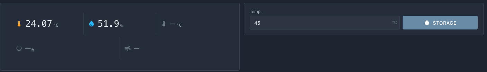
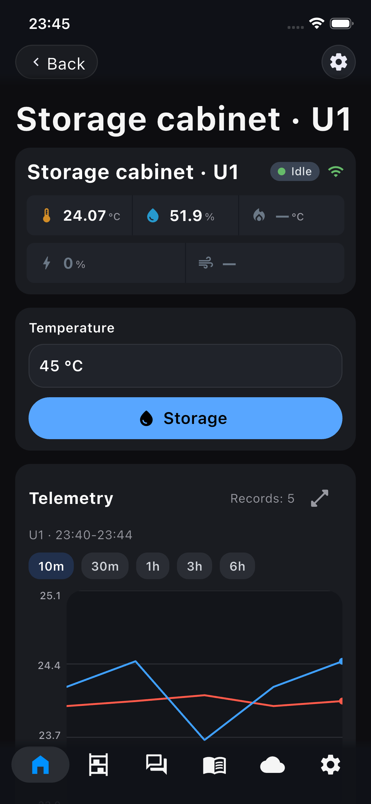
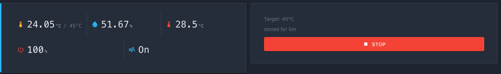
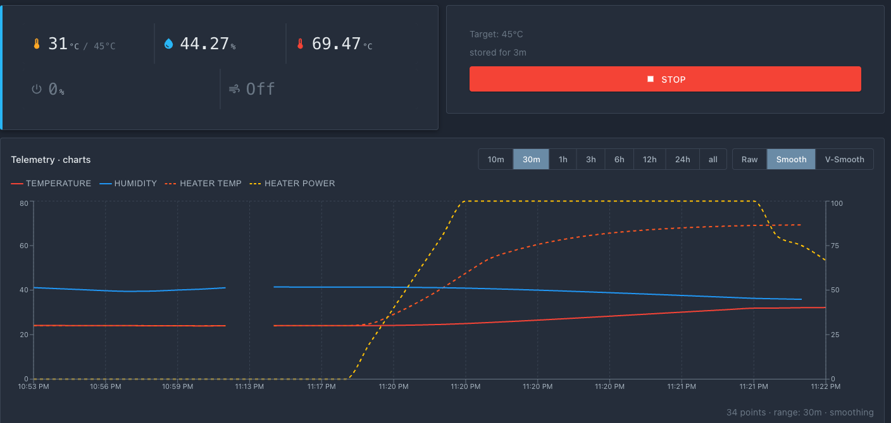
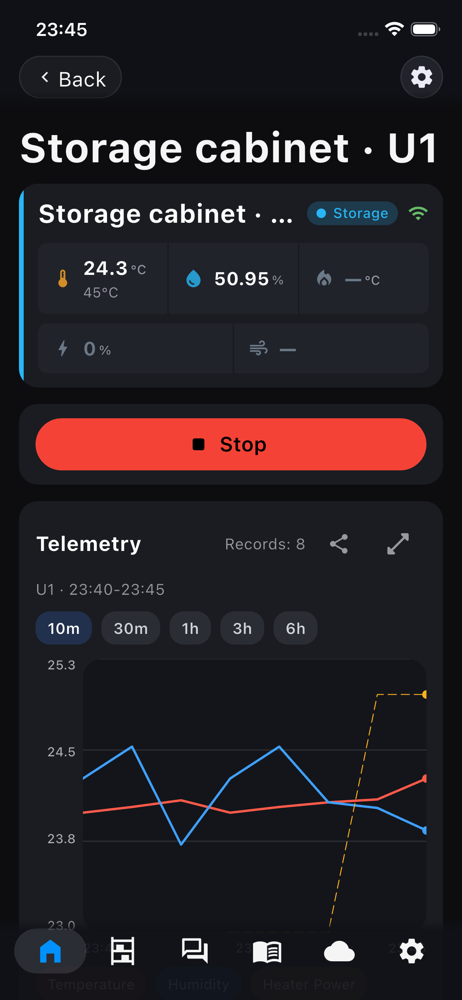
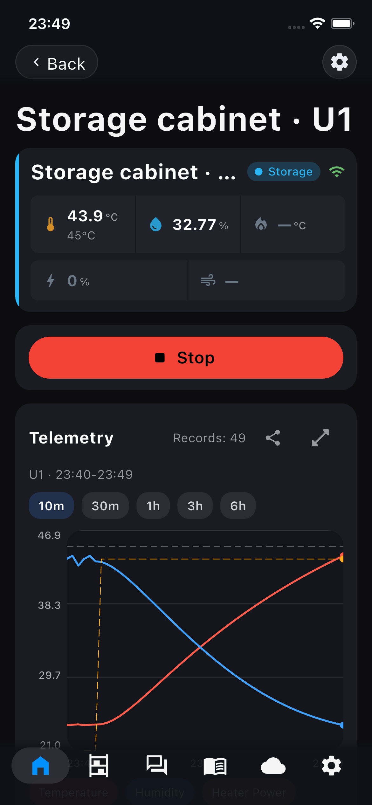

# Control de calefacción

En esta página conecta los sensores, configuraciones y la parte de potencia en una lógica operativa. El dispositivo mantiene una temperatura establecida dentro del gabinete, protege el calentador del sobrecalentamiento y responde a comandos desde el portal.

La lógica se ejecuta en `loop()` junto con el mantenimiento de la red. Todos los temporizadores y umbrales son no bloqueantes, sin `delay()`.

## Qué debe suceder

El comportamiento del gabinete se basa en tres reglas simples:

1. **Mantenimiento de temperatura.** Si el aire en el gabinete está más frío que el objetivo por la cantidad de histéresis, encienda la calefacción. Cuando alcance el objetivo, apague.
2. **Protección del calentador.** El termistor controla el calentador mismo. Si se sobrecalienta por encima del límite permitido, la calefacción se apaga independientemente de la temperatura del aire.
3. **Ventilador.** Se enciende para distribuir el calor en el gabinete y se apaga cuando la calefacción no es necesaria.

## Llaves del calentador y ventilador

El controlador enciende el calentador y el ventilador a través de una llave: módulo MOSFET (versión A) o SSR (versión B) — vea [Diagrama de conexión](03-wiring.md). Desde el punto de vista del código, es simplemente una salida GPIO: `HIGH` — encendido, `LOW` — apagado.

Describa tal llave con una pequeña estructura y cree dos instancias — para el calentador y el ventilador. Agregue esto a `src/main.cpp` (antes de `setup()`):

```cpp
struct GpioOutput {
    int pin;
    void begin() { pinMode(pin, OUTPUT); digitalWrite(pin, LOW); }
    void on()    { digitalWrite(pin, HIGH); }
    void off()   { digitalWrite(pin, LOW); }
};

static GpioOutput myHeater{4};   // GPIO4 — control del calentador
static GpioOutput myFan{5};      // GPIO5 — control del ventilador
```

Los números de pines son los mismos que en [Diagrama de conexión](03-wiring.md). En `setup()` ambas llaves deben inicializarse: `myHeater.begin();` y `myFan.begin();`.

!!! warning "Estado seguro al iniciar"
    `begin()` inmediatamente establece `LOW` — el calentador y el ventilador están apagados hasta que la lógica decida lo contrario. Esto es importante: al encender la alimentación, el calentador no debe encenderse accidentalmente.

## Mantenimiento de temperatura por histéresis

Para un gabinete a `40–45 °C` es suficiente una histéresis simple: la calefacción se enciende y apaga alrededor del objetivo. Esto es más simple que un PID completo y funciona de manera confiable para mantener el calor de manera suave.

La histéresis se toma del menú (`menu.hysteresis`), ya conectado en el [capítulo 6](06-menu.md). La temperatura objetivo la fija el usuario al iniciar el armario desde la tarjeta del dispositivo (`s_targetC`; la tarjeta se conecta más adelante en este capítulo). Solo se calienta en modo Storage. Añade el estado y la función de decisión:

```cpp
static bool  s_heating = false;
static float s_targetC = 0.0f;   // objetivo del arranque actual, desde la tarjeta

static void controlLoop() {
    // Calentar solo en modo Storage: tras Detener, el armario se enfría.
    if (s_link.status.mode[0] != iDryer::UnitMode::Storage) {
        s_heating = false;
        return;
    }
    float air    = s_link.telemetry.airTempC[0];     // SHT31
    float target = s_targetC;                        // desde la tarjeta
    float hyst   = (float)menu.hysteresis;           // del menú

    if (air < target - hyst) {
        s_heating = true;     // se enfrió — calentar
    } else if (air >= target) {
        s_heating = false;    // alcanzó el objetivo — parar
    }
}
```

La temperatura objetivo llega con el comando de arranque desde la tarjeta; sus límites y su valor por defecto son el elemento `target_temp` del [menú](06-menu.md).

## Protección del calentador por termistor

El aire se calienta lentamente, pero la bobina del calentador se calienta rápidamente. Sin un control separado, el calentador se sobrecalentará antes de que el aire alcance el objetivo. Por lo tanto, el termistor del calentador establece un límite máximo duro.

```cpp
static const float HEATER_MAX_C = 80.0f;   // límite de temperatura del calentador

static void applyHeater() {
    float heaterTemp = s_link.telemetry.heaterTempC[0];   // termistor

    bool allow = s_heating && heaterTemp < HEATER_MAX_C;

    if (allow) {
        myHeater.on();
        s_link.telemetry.heaterPower01[0] = 1.0f;   // reflejar en telemetría
    } else {
        myHeater.off();
        s_link.telemetry.heaterPower01[0] = 0.0f;
    }
}
```

!!! warning "El límite del calentador es protección, no ajuste climático"
    `HEATER_MAX_C` limita la temperatura del calentador mismo, no del aire. El valor depende de la construcción del calentador y los materiales de la carcasa. Elíjalo con un margen por debajo de la temperatura a la cual se deforman las piezas impresas — vea [Materiales resistentes al calor](../07-3d-printing/04-heat-resistant-materials.md).

Para un calentamiento más suave en lugar de encendido/apagado "todo o nada", puede controlar la potencia a través de PWM y el campo `heaterPower01[0]` acepta valores de `0.0` a `1.0`. Para un gabinete con mantenimiento suave del calor, la lógica simple anterior generalmente es suficiente.

## Ventilador

El ventilador distribuye el calor en el gabinete. La lógica más simple es encenderlo junto con la calefacción:

```cpp
static void applyFan() {
    bool fanOn = s_heating;          // giramos mientras calentamos
    if (fanOn) myFan.on(); else myFan.off();
    s_link.telemetry.fanOn[0] = fanOn;   // reflejar en telemetría
}
```

En el controlador de serie, el ventilador se controla por temperatura con umbrales separados de encendido y apagado (por ejemplo, encendido a `55 °C`, apagado a `35 °C`), para que no fluctúe en el límite. Para el gabinete puede aplicar el mismo enfoque, vinculando los umbrales a parámetros del menú.

## Ensamblando en loop()

```cpp
void loop() {
    s_link.loop();          // red y auto-publicación

    // sensores (vea el paso "Sensores"):
    s_climate.tick(millis());
    SensorReading c = s_climate.get();
    if (c.ok) {
        s_link.telemetry.airTempC[0]       = c.temperature;
        s_link.telemetry.airHumidityPct[0] = c.humidity;
    }
    s_link.telemetry.heaterTempC[0] = readHeaterTempC();

    controlLoop();   // decidimos si calentar o no
    applyHeater();   // aplicamos al calentador + protección
    applyFan();      // aplicamos al ventilador
}
```

Los campos de telemetría (`heaterPower01`, `fanOn`) se publican automáticamente por la fachada — en el portal se ve si el dispositivo está calentando ahora y si funciona el ventilador.

## Tarjeta: arranque y parada

El arranque y la parada llegan desde la tarjeta del dispositivo en el portal y en la aplicación. El firmware los declara como **acciones** de la tarjeta: el core las añade al card manifest y el portal y la aplicación dibujan el formulario y los botones. No hace falta analizar comandos en tu código: el core llama a tu función.


*La tarjeta está armada a partir del manifiesto: a la izquierda las lecturas, incluidas la potencia de calefacción y el ventilador; a la derecha el formulario con la temperatura y el botón de arranque. El portal no sabía nada de este dispositivo — todo llegó desde el firmware.*


*En la aplicación es lo mismo y desde el mismo manifiesto: lecturas, campo de temperatura y botón de arranque.*

Los límites del campo de temperatura y su valor por defecto se toman del elemento del menú `target_temp` (30–50 °C, 45) mediante el puente `card_menu_bridge.h`. El valor que introduce el usuario va con el comando de arranque y no se escribe en el menú. Añade la cabecera junto a las cabeceras del menú del capítulo 6:

```cpp
#include <card/card_menu_bridge.h>
```

Callbacks de las acciones, antes de `setup()`:

```cpp
static void onStorage(uint8_t unit, JsonObjectConst args) {
    s_targetC = args["temperature"].as<float>();   // ya dentro de 30..50
    s_link.status.mode[unit]        = iDryer::UnitMode::Storage;
    s_link.status.targetTempC[unit] = s_targetC;
    s_link.publishStatusNow();
}

static void onStop(uint8_t unit, JsonObjectConst) {
    s_link.status.mode[unit]        = iDryer::UnitMode::Idle;
    s_link.status.targetTempC[unit] = 0.0f;
    s_link.publishStatusNow();
}
```

En `setup()`, después de los comandos del menú del capítulo 6, declara las acciones. Los valores del menú ya están en la caché que lee la tarjeta: `setup()` llama a `menu_sync_state_to_cache()` desde el capítulo 6.

```cpp
auto& card = s_link.card();
idryer::card_menu::attach(card);
card.action("storage", "STORAGE", onStorage)
    .name("ru", "Хранение").name("en", "Storage")
    .param("temperature", "target_temperature", MENU_TARGET_TEMP);
card.action("stop", "IDLE", onStop)
    .name("ru", "Стоп").name("en", "Stop");
```

- `"STORAGE"` y `"IDLE"` — el modo de la unidad después de la acción. Mientras el armario está en reposo, la tarjeta muestra el formulario de arranque; en modo `STORAGE`, el bloque de sesión y el botón Detener.
- `MENU_TARGET_TEMP` — el id del elemento `target_temp`; el generador lo pone en `menu_ids.h`.
- `s_link.status.mode[0]` y `targetTempC[0]` muestran el estado actual de la cámara. Llama a `publishStatusNow()` tras cada cambio para que la tarjeta cambie al instante.
- `iDryer::UnitMode::Storage` — modo de mantenimiento suave del calor. Es el modo principal del armario.
- Cambia la temperatura de almacenamiento en el menú del dispositivo en el portal: el valor por defecto del campo de la tarjeta la sigue, porque el core detecta el cambio del menú y vuelve a publicar el manifiesto.

El core añade al card manifest:

```json
"actions": [
  {"id": "storage", "mode": "STORAGE", "name": {"ru": "Хранение", "en": "Storage"}, "action": "card.storage",
   "params": [{"id": "temperature", "purpose": "target_temperature", "type": "number",
               "limits": [30, 50], "step": 1, "default": 45, "unit": "°C"}]},
  {"id": "stop", "mode": "IDLE", "name": {"ru": "Стоп", "en": "Stop"}, "action": "card.stop"}
]
```

En el portal, la tarjeta del armario en reposo recibe el campo `Temp.` con 45 °C y el botón `Almacenamiento`; tras el arranque, el bloque de sesión con el objetivo y el botón `Detener`. En la aplicación, la pantalla de inicio muestra las lecturas y la sesión en curso; el arranque y la parada están en la página del dispositivo. Los sensores, campos y la disposición de la tarjeta se tratan en el capítulo [Tarjeta del dispositivo](../10-build-a-filter/06-card.md) de la sección del filtro de aire.

!!! warning "Nada de delay() en los callbacks"
    Los callbacks de las acciones se llaman desde el manejador de red. Cualquier bloqueo dentro corta la sesión MQTT. Cambia el objetivo y el estado; el trabajo real, en `loop()`.

## `src/main.cpp` completo después de este capítulo

Este es el archivo final y completo del dispositivo. Las nuevas líneas respecto al capítulo anterior se marcan con `// ← capítulo 7`. Este mismo archivo se encuentra como ejemplo listo en la carpeta `example/09-cabinet/` del repositorio y se compila con el comando `pio run -e cabinet`.

??? note "Cómo quedó — `src/main.cpp` tras el capítulo 6"

    ```cpp
    #include <iDryer.h>
    #include <Wire.h>
    #include <math.h>
    #include "Sht31ClimateSensor.h"
    #include "demo_sensors.h"    // lecturas sin sensores (-DDEMO_SENSORS=1)
    #include <menu_state.h>                      // ← capítulo 6: parámetros (menu.target_temp …)
    #include <menu_bindings.h>                   // ← capítulo 6: menu_apply_by_bind
    #include <menu_commands.h>                   // ← capítulo 6: menu_buildFullJson
    #include <local_access/device_publisher.h>   // ← capítulo 6: publishConfigRaw

    static const iDryer::Config CFG = {
        .deviceType        = iDryer::DeviceType::Unknown,   // dispositivo propio: la tarjeta la arma el manifiesto
        .unitsCount        = 1,
        .hasAirTemp        = true,
        .hasAirHumidity    = true,
        .hasHeaterTemp     = true,
        .telemetryPeriodMs = 5000,
        .statusPeriodMs    = 10000,
        .hardwareVersion   = "1.0",
        .firmwareVersion   = "0.1.0",
        .model             = "DIY Storage Cabinet",
    };
    static iDryer::Link s_link(CFG);

    static Sht31ClimateSensor s_climate(&Wire);
    static bool               s_climateOk = false;

    static const int   THERM_PIN  = 2;
    static const float SERIES_R   = 4700.0f;
    static const float NOMINAL_R  = 100000.0f;
    static const float NOMINAL_T  = 25.0f;
    static const float BETA       = 3950.0f;

    static float readHeaterTempC() {
        int   raw = analogRead(THERM_PIN);
        float v   = (float)raw / 4095.0f;
        float r   = SERIES_R * (1.0f - v) / v;
        float tK  = 1.0f / (1.0f / (NOMINAL_T + 273.15f) + logf(r / NOMINAL_R) / BETA);
        return tK - 273.15f;
    }

    // Lecturas: sensores o, con -DDEMO_SENSORS=1, el modelo del armario
    static void readSensors() {
    #ifdef DEMO_SENSORS
        demoSensors(s_link.telemetry);
    #else
        if (s_climateOk) {
            s_climate.tick(millis());
            SensorReading r = s_climate.get();
            if (r.ok) {
                s_link.telemetry.airTempC[0]       = r.temperature;
                s_link.telemetry.airHumidityPct[0] = r.humidity;
            }
        }
        s_link.telemetry.heaterTempC[0] = readHeaterTempC();
    #endif
    }

    // ← capítulo 6: menú en el portal
    static bool s_menuPending = false;

    static void publishMenu() {
        static char buf[MENU_FULL_JSON_BUF_SIZE];
        const size_t len = menu_buildFullJson(buf, sizeof(buf));
        if (len > 0) s_link.devicePublisher()->publishConfigRaw(buf, len);
    }

    static void applySet(JsonObjectConst data) {
        const int id = data["id"] | -1;
        float v = data["val"].is<bool>() ? (data["val"].as<bool>() ? 1.0f : 0.0f)
                                         : data["val"].as<float>();
        for (uint16_t i = 0; i < g_bindings_count; i++) {
            if ((int)g_bindings[i].id != id) continue;
            const MenuMeta& m = g_menu_meta[id];
            if (v < m.min_val) v = m.min_val;
            if (v > m.max_val) v = m.max_val;
            menu_apply_by_bind(g_bindings[i].bind, v);
            s_menuPending = true;
            return;
        }
    }

    void setup() {
        Serial.begin(115200);
        Wire.begin(8, 9);
        s_climateOk = s_climate.begin();
        menu.initDefaults();                     // ← capítulo 6
        menu.loadFromNVS();                      // ← capítulo 6
        menu_sync_state_to_cache();              // ← capítulo 6
        s_link.begin();
        // El dispositivo se desvinculó en el portal: borrar el secreto y esperar una nueva vinculación.
        s_link.onCommand("revoke", [](JsonObjectConst) { s_link.handleRevoke(); });
        s_link.onCommand("get_config", [](JsonObjectConst) { s_menuPending = true; });   // ← capítulo 6
        s_link.onCommand("set", [](JsonObjectConst data) { applySet(data); });           // ← capítulo 6
    }

    void loop() {
        s_link.loop();

        // ← capítulo 6: publicar el menú al pasar a en línea y a petición
        static bool s_wasOnline = false;
        const bool online = s_link.isOnline();
        if (online && !s_wasOnline) s_menuPending = true;
        s_wasOnline = online;
        if (s_menuPending) {
            s_menuPending = false;
            publishMenu();
        }

        readSensors();
    }
    ```

```cpp
#include <iDryer.h>
#include <Wire.h>
#include <math.h>
#include "Sht31ClimateSensor.h"
#include "demo_sensors.h"    // lecturas sin sensores (-DDEMO_SENSORS=1)
#include <menu_state.h>
#include <menu_bindings.h>
#include <menu_commands.h>
#include <local_access/device_publisher.h>
#include <card/card_menu_bridge.h>        // ← capítulo 7

static const iDryer::Config CFG = {
    .deviceType        = iDryer::DeviceType::Unknown,   // dispositivo propio: la tarjeta la arma el manifiesto
    .unitsCount        = 1,
    .hasHeater         = true,     // ← capítulo 7
    .hasFan            = true,        // ← capítulo 7
    .hasAirTemp        = true,
    .hasAirHumidity    = true,
    .hasHeaterTemp     = true,
    .telemetryPeriodMs = 5000,
    .statusPeriodMs    = 10000,
    .hardwareVersion   = "1.0",
    .firmwareVersion   = "0.1.0",
    .model             = "DIY Storage Cabinet",
};
static iDryer::Link s_link(CFG);

static Sht31ClimateSensor s_climate(&Wire);
static bool               s_climateOk = false;

static const int   THERM_PIN  = 2;
static const float SERIES_R   = 4700.0f;
static const float NOMINAL_R  = 100000.0f;
static const float NOMINAL_T  = 25.0f;
static const float BETA       = 3950.0f;

static float readHeaterTempC() {
    int   raw = analogRead(THERM_PIN);
    float v   = (float)raw / 4095.0f;
    float r   = SERIES_R * (1.0f - v) / v;
    float tK  = 1.0f / (1.0f / (NOMINAL_T + 273.15f) + logf(r / NOMINAL_R) / BETA);
    return tK - 273.15f;
}

// Lecturas: sensores o, con -DDEMO_SENSORS=1, el modelo del armario
static void readSensors() {
#ifdef DEMO_SENSORS
    demoSensors(s_link.telemetry);
#else
    if (s_climateOk) {
        s_climate.tick(millis());
        SensorReading r = s_climate.get();
        if (r.ok) {
            s_link.telemetry.airTempC[0]       = r.temperature;
            s_link.telemetry.airHumidityPct[0] = r.humidity;
        }
    }
    s_link.telemetry.heaterTempC[0] = readHeaterTempC();
#endif
}

static bool s_menuPending = false;

static void publishMenu() {
    static char buf[MENU_FULL_JSON_BUF_SIZE];
    const size_t len = menu_buildFullJson(buf, sizeof(buf));
    if (len > 0) s_link.devicePublisher()->publishConfigRaw(buf, len);
}

static void applySet(JsonObjectConst data) {
    const int id = data["id"] | -1;
    float v = data["val"].is<bool>() ? (data["val"].as<bool>() ? 1.0f : 0.0f)
                                     : data["val"].as<float>();
    for (uint16_t i = 0; i < g_bindings_count; i++) {
        if ((int)g_bindings[i].id != id) continue;
        const MenuMeta& m = g_menu_meta[id];
        if (v < m.min_val) v = m.min_val;
        if (v > m.max_val) v = m.max_val;
        menu_apply_by_bind(g_bindings[i].bind, v);
        s_menuPending = true;
        return;
    }
}

// ← capítulo 7: llaves del calentador y ventilador
struct GpioOutput {
    int pin;
    void begin() { pinMode(pin, OUTPUT); digitalWrite(pin, LOW); }
    void on()    { digitalWrite(pin, HIGH); }
    void off()   { digitalWrite(pin, LOW); }
};
static GpioOutput myHeater{4};
static GpioOutput myFan{5};

// ← capítulo 7: lógica de mantenimiento de temperatura
static bool        s_heating    = false;
static float       s_targetC    = 0.0f;
static const float HEATER_MAX_C = 80.0f;

static void controlLoop() {
    if (s_link.status.mode[0] != iDryer::UnitMode::Storage) { s_heating = false; return; }
    float air    = s_link.telemetry.airTempC[0];
    float target = s_targetC;
    float hyst   = (float)menu.hysteresis;
    if (air < target - hyst)  s_heating = true;
    else if (air >= target)   s_heating = false;
}

static void applyHeater() {
    float heaterTemp = s_link.telemetry.heaterTempC[0];
    bool  allow = s_heating && heaterTemp < HEATER_MAX_C;
    if (allow) myHeater.on(); else myHeater.off();
    s_link.telemetry.heaterPower01[0] = allow ? 1.0f : 0.0f;
}

static void applyFan() {
    if (s_heating) myFan.on(); else myFan.off();
    s_link.telemetry.fanOn[0] = s_heating;
}

// ← capítulo 7: acciones de la tarjeta
static void onStorage(uint8_t unit, JsonObjectConst args) {
    s_targetC = args["temperature"].as<float>();
    s_link.status.mode[unit]        = iDryer::UnitMode::Storage;
    s_link.status.targetTempC[unit] = s_targetC;
    s_link.publishStatusNow();
}

static void onStop(uint8_t unit, JsonObjectConst) {
    s_link.status.mode[unit]        = iDryer::UnitMode::Idle;
    s_link.status.targetTempC[unit] = 0.0f;
    s_link.publishStatusNow();
}

void setup() {
    Serial.begin(115200);
    Wire.begin(8, 9);
    s_climateOk = s_climate.begin();
    myHeater.begin();              // ← capítulo 7
    myFan.begin();                 // ← capítulo 7
    menu.initDefaults();
    menu.loadFromNVS();
    menu_sync_state_to_cache();
    s_link.begin();
    // El dispositivo se desvinculó en el portal: borrar el secreto y esperar una nueva vinculación.
    s_link.onCommand("revoke", [](JsonObjectConst) { s_link.handleRevoke(); });
    s_link.onCommand("get_config", [](JsonObjectConst) { s_menuPending = true; });
    s_link.onCommand("set", [](JsonObjectConst data) { applySet(data); });

    auto& card = s_link.card();                          // ← capítulo 7
    idryer::card_menu::attach(card);
    card.action("storage", "STORAGE", onStorage)
        .name("ru", "Хранение").name("en", "Storage")
        .param("temperature", "target_temperature", MENU_TARGET_TEMP);
    card.action("stop", "IDLE", onStop)
        .name("ru", "Стоп").name("en", "Stop");
}

void loop() {
    s_link.loop();

    static bool s_wasOnline = false;
    const bool online = s_link.isOnline();
    if (online && !s_wasOnline) s_menuPending = true;
    s_wasOnline = online;
    if (s_menuPending) {
        s_menuPending = false;
        publishMenu();
    }

    readSensors();

    controlLoop();   // ← capítulo 7
    applyHeater();   // ← capítulo 7
    applyFan();      // ← capítulo 7
}
```

## Verificación del resultado


*Justo después del arranque: modo Storage, objetivo 45 °C, potencia 100 %, ventilador encendido, el tiempo corre.*


*Tres minutos después: el aire del armario subió, la humedad bajó, el calefactor alcanzó su temperatura de trabajo. En el gráfico se ve cómo la potencia se enciende y se apaga por la histéresis.*


*El almacenamiento también se puede iniciar desde la aplicación: aparecen el botón «Detener» y la cuenta del tiempo.*


*Tres minutos después en la aplicación: 43,9 de 45 °C, la humedad bajó del 51 al 33 %. En el gráfico la temperatura sube y la humedad baja.*

Después de este paso:

- el botón `Almacenamiento` de la tarjeta del dispositivo pone el armario en modo Storage con la temperatura introducida y el dispositivo empieza a calentar;
- la temperatura del aire se ajusta al objetivo y se mantiene dentro de los límites de la histéresis;
- el calentador no sobrepasa `HEATER_MAX_C`;
- el ventilador y la potencia de calefacción se ven en la telemetría;
- el botón `Detener` apaga la calefacción y pasa a Idle; hasta el siguiente arranque el armario no calienta.

## Qué sigue

La lógica está lista. Queda ensamblar el dispositivo en la carcasa y verificar bajo carga — [Ensamblaje y verificación](08-assembly-and-check.md).
