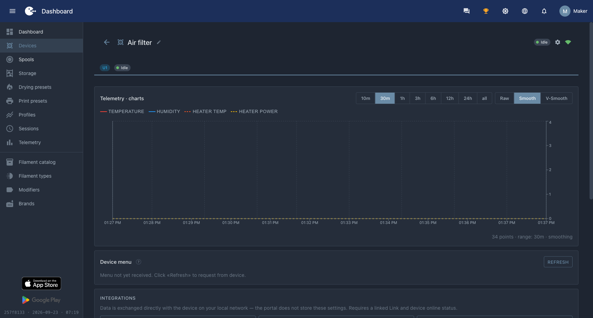

# Inicio del firmware

La estructura del proyecto repite completamente el [capítulo del ejemplo del gabinete](../09-build-a-device/04-firmware-start.md): PlatformIO, `idryer-core` en `lib/`, el mismo `platformio.ini` (solo reemplaza el nombre del entorno por `filter`). Aquí — solo lo que difiere.

El proyecto terminado de este capítulo es [example/10-filter](https://github.com/pavluchenkor/Build-Your-Own-iDryer/tree/main/example/10-filter) en el repositorio del manual: de ahí se toman el `platformio.ini` y todo el código que más adelante se analiza por partes. La biblioteca del núcleo — [idryer-core](https://github.com/pavluchenkor/idryer-core).

!!! note "Log al puerto: dos banderas de compilación"
    En el ESP32-C3 la salida de `Serial` va por defecto a los pines UART0 y no al puerto USB de la placa — el monitor del puerto se queda vacío. Para ver el log, en `build_flags` hacen falta dos líneas:

    ```ini
    -DARDUINO_USB_MODE=1
    -DARDUINO_USB_CDC_ON_BOOT=1
    ```

    Los mensajes del propio ESP-IDF (errores de mDNS y similares) llegan por USB incluso sin ellas, por eso "algo se imprime, pero mis líneas no aparecen" es justamente la señal de que faltan estas banderas.

## Config: dispositivo de tipo no estándar

El filtro no tiene ni calefactor ni sensor climático del diccionario del ecosistema. De las habilidades "del diccionario" solo tiene ventilador. En `src/main.cpp`:

```cpp
#include <iDryer.h>

static const iDryer::Config CFG = {
    .deviceType        = iDryer::DeviceType::Unknown, // dispositivo no estándar
    .unitsCount        = 1,
    // Periféricos: del diccionario del ecosistema solo tenemos ventilador.
    .hasFan            = true,
    // Períodos de publicación automática:
    .telemetryPeriodMs = 5000,
    .statusPeriodMs    = 10000,
    // Identificación en el portal:
    .hardwareVersion   = "1.0",
    .firmwareVersion   = "0.1.0",
    .model             = "DIY Air Filter",
};

static iDryer::Link s_link(CFG);

void setup() {
    Serial.begin(115200);
    s_link.begin();
    // El dispositivo se desvinculó en el portal: borrar el secreto y esperar una nueva vinculación.
    s_link.onCommand("revoke", [](JsonObjectConst) { s_link.handleRevoke(); });
}

void loop() {
    s_link.loop();
}
```

!!! note "DeviceType::Unknown — está bien"
    El tipo `Unknown` significa "el portal no conoce este producto". Antes esto era un problema: el portal no tenía tarjeta para un tipo desconocido. Ahora es el camino estándar: el interface del dispositivo lo describir completamente el card manifest ([capítulo 6](06-card.md)), y el portal construirá la tarjeta según él. El tipo es necesario solo para los "propios" productos de iDryer, que tienen tarjetas de marca.

La bandera `hasFan = true` nos da de forma gratuita: el campo `fanStatus` en telemetría, la celda "Ventilador" en la tarjeta y una entidad en el manifest — todo del diccionario del ecosistema.

## No hay un sensor VOC en Config — y no debería haberlo

Fíjate: no hay una bandera "hasVoc" en `Config`. El diccionario `has*` describe la periféria que conoce el ecosistema. Tu sensor propio lo agregarás no a través del diccionario, sino a través de dos mecanismos diferentes: escribirás tus lecturas en la telemetría con tu propio campo y lo declararás en el card manifest — estos son los dos capítulos siguientes. En eso está la esencia del enfoque: el diccionario no necesita expandirse para cada dispositivo nuevo.

## Primer inicio y vinculación

El procedimiento es el mismo que para el armario:

1. Graba la placa y abre el Serial Monitor: mientras el dispositivo no tiene Wi-Fi, el log está en silencio.
2. En la aplicación iDryer: **Conectar un dispositivo nuevo** → paso **Wi-Fi** (red y contraseña, **Conectar dispositivo**) → paso **Vinculación** → **Vincular**.
3. Tras **Dispositivo vinculado**, el dispositivo queda vinculado a tu cuenta y pasa a `Online` en el portal; en el log aparece `MQTT: Connected!`.

Detalles, posibles errores y nueva vinculación: en el [capítulo del ejemplo del armario](../09-build-a-device/04-firmware-start.md).


*Dispositivo en el portal: nombre, estado Idle, icono de conexión. El gráfico está vacío y el menú no llegó — el dispositivo no declaró nada sobre ellos.*

El dispositivo ya es visible en el portal, pero la tarjeta sigue casi vacía — aún no hay datos. Vamos a conectar el sensor.
