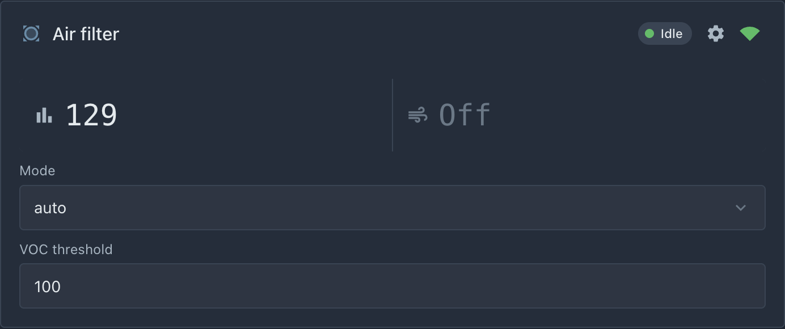
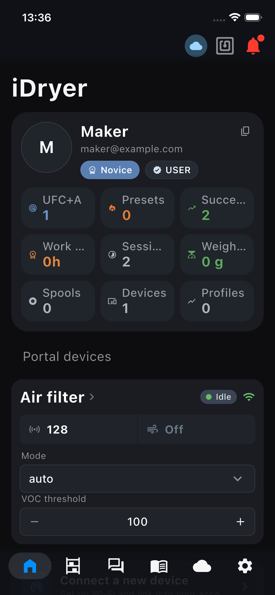

# デバイスカード

これがこのセクションのメインとなる章です。ここでデバイスはポータルとモバイルアプリ上にインターフェースを取得します — **それらの側でコードを一行も書かずに**。

## 仕組み

デバイスが**card manifest**を公開 — マシンリーダブルな「何を表示してどれを制御するか」の説明。ポータルとアプリはマニフェストを読み、カードを構築: センサーはライブ値のセルになり、制御はボタン、入力フィールド、リストになります。レイアウトもファームウェアから設定できます。

手動で何も公開する必要はありません: `link.card()`を通じてエンティティを宣言し、コアが自動的にマニフェストを収集して接続時に送信します。

## 1. エンティティを宣言

すべての宣言は`setup()`内、`s_link.begin()`の後で行われます。フィルターには3つのエンティティ: VOC読み取り、モードリスト、閾値フィールド。それぞれを別々に分解し、最後に全体を組み立てます。

### 一般的な原則: idとlabel

各エンティティは2つの名前を持ちます、混同しないでください:

- **id** — 内部、マシン名（`"voc"`、`"mode"`）。ラテン文字、数字、アンダースコア、スペースなし。idでエンティティが認識 — レイアウト、コマンド、ポータル間。一度作ったら変更しない;
- **label** — 人間向けサイン（`"VOC index"`、`"Mode"`）。書いたものはユーザーに見えます。自由に変更可能。

### センサー: VOC読み取り

```cpp
s_link.card().sensor(
    "voc",              // id: エンティティ内部名
    "VOC index",        // label: カード上のサイン
    "",                 // unit: 数字右の計測単位（"°C", "%", "g");
                        //   VOCインデックスに単位はない — 空文字列
    "units[0].vocIndex" // path: 値をどこから取るか — テレメトリJSON内パス。
                        //   これは我々が第5章で追加したフィールドです:
                        //   doc["units"][0]["vocIndex"]。名前は全く一致する必要があります
                        //   そうでないとカード上に「—」が出現します。
);
```

センサー — これは「読み取りのみ」セル: ポータルは`path`でテレメトリから値を取り、表示します。センサーにコマンドはありません。

### リスト選択: 稼働モード

```cpp
// リストのオプション。ユーザーはドロップダウンメニューでこれらを見ます。
static const char* kModes[] = { "auto", "on", "off" };

s_link.card().select(
    "mode",                  // id: エンティティ内部名
    "Mode",                  // label: カード上のサイン
    kModes,                  // options: オプション配列（上で宣言）
    3,                       // 配列内のオプション数 — auto, on, off = 3。
                             //   C++は配列長を知りません、ユーザーが報告
    [](const char* opt) {    // コールバック: ユーザーが
                             //   ポータルでオプションを選ぶ時にコアが呼ぶ関数。
                             //   opt — 選んだ文字列、例えば"on"
        onModeSelected(opt); //   我々のロジックに渡す（第7章で書く）
    }
);
```

ここでメカニズムの第二の部分が現れます: **制御**。ユーザーがポータルでオプションを選択すると、デバイスにコマンドが送られ、コアが自動的に受け取り、検証し（`options`にない文字列はあなたのコードに届きません）、選択された値でコールバックを呼び出します。MQTTメッセージを手動で解析する必要はありません — あなたの担当範囲は`onModeSelected`の中から始まります。

### 数値フィールド: 起動閾値

```cpp
s_link.card().number(
    "threshold",       // id: エンティティ内部名
    "VOC threshold",   // label: カード上のサイン
    100,               // min: ポータルはこれより低い入力を許可しない
    400,               // max: これより高い — 許可しない; コアはさらに
                       //   その側でこれらの境界に値をカット
    10,                // step: 矢印でのフィールド値変更のステップ
    "",                // unit: 計測単位; インデックスに単位はない
    [](float v) {              // コールバック: ユーザーが
                               //   新しい値を送信した時に呼ぶ; v — min..max範囲の数字
        onThresholdChanged(v); //   ロジックに渡す（第7章で書く）
    }
);
```

### 全部を集める

`setup()`の最終形 — コードに残すべき内容です。関数`onModeSelected`と`onThresholdChanged`は第7章で実装します。今すぐコンパイルできるよう、`setup()`より**上に空のスタブとして宣言**してください:

```cpp
// スタブ: 本体は第7章で書く（オートメーションロジック）。
static void onModeSelected(const char* opt) {}
static void onThresholdChanged(float v) {}

void setup() {
    Serial.begin(115200);
    s_link.begin();
    // ポータルで紐付けが解除された：シークレットを消去し、新しいペアリングを待つ
    s_link.onCommand("revoke", [](JsonObjectConst) { s_link.handleRevoke(); });
    initVocSensor();

    // テレメトリ: 独自フィールドvocIndex（第5章）。
    s_link.onTelemetryPublish([](JsonObject doc) {
        if (g_vocIndex >= 0) {
            doc["units"][0]["vocIndex"] = g_vocIndex;
        }
    });

    // カード: センサー + 2つの制御。
    s_link.card().sensor("voc", "VOC index", "", "units[0].vocIndex");

    static const char* kModes[] = { "auto", "on", "off" };
    s_link.card().select("mode", "Mode", kModes, 3, [](const char* opt) {
        onModeSelected(opt);
    });

    s_link.card().number("threshold", "VOC threshold", 100, 400, 10, "", [](float v) {
        onThresholdChanged(v);
    });
}
```

ファンは? **宣言する必要がない**: `Config`内の`hasFan = true`フラグが「ファン」セルをマニフェストに自動追加 — 辞書スキル、コアはそれについてすべて知ります。

!!! note "コールバック内の角括弧 — 常に空"
    `[](const char* opt) { ... }` はラムダ（名前のない関数）です。[第5章のコラム](05-sensor-and-telemetry.md)で詳しく解説しています。おさらい: コアのルールはキャプチャ括弧を常に空（`[]`）にすること。ラムダは何もキャプチャせず、必要なものはすべてグローバル変数に保存します — 次の章の`g_mode`や`g_threshold`がその例です。

## 2. カードの自動レイアウト

レイアウトは指定しなくても構いません。ポータルは宣言されたエンティティから自動的にカードを構築します — 整然と: センサーセルは行にグループ化（1行最大3つ、それ以降は折り返し）、制御要素はその下に各自1行ずつ、ポータルの標準スタイルで。ほとんどのデバイスにはこれで十分です — レイアウトを意識しなくても見やすいインターフェースになります。

カード上のエンティティの順序は`setup()`での宣言順になります。

## 3. カードのカスタムレイアウト（オプション）

まずカードの構造から。カードは**行**の垂直スタックです。センサーのセルの行は幅を均等に分けます。1つなら全幅、2つなら半分ずつ、3つなら3分の1ずつです。行の中の操作部品（リスト、フィールド、ボタン）は全幅で上下に並びます。

前のセクションの自動レイアウトはこの行にエンティティを自動で割り振ります。何と何を横に並べるかを自分で決めたい場合は、`layoutRow`呼び出しで行を手動で設定してください。1回の呼び出し = 1行、呼び出し順 = 行の上から下の順序です:

```cpp
// 行1: 2セル — VOCインデックスとファン、各々半幅。
s_link.card().layoutRow("voc", "fan");

// 行2: 2つの操作部品 — モードとしきい値、上下に並ぶ。
s_link.card().layoutRow("mode", "threshold");
```

`layoutRow`にはエンティティの**id**を渡します — 宣言時に付けた内部名です（idが必要な理由はここにあります）。`"fan"` はファン辞書エンティティのidで、`hasFan`フラグが自動生成したものです。

カード上のレイアウトはこのようになります:

```text
┌─ Air filter ────────────────────┐
│  ▮ 129            │  ≋ オフ     │   ← 行1: voc, fan
├───────────────────┴─────────────┤
│  Mode                           │   ← 行2: mode, threshold
│  [auto                       ▾] │
│  VOC threshold                  │
│  [100                         ] │
└─────────────────────────────────┘
```

セルに注目してください: ポータルはアイコンと値を描き、ラベルは描きません。エンティティの`label`はスクリーンリーダー用の名前や他のインターフェースへ渡され、カード上の場所は節約されます。操作部品ではラベルが見えます — 上の図の`Mode`と`VOC threshold`です。

どの行にも指定されなかったエンティティは消えません — ポータルが自動的にリストとして下に追加します。「主要なもの」だけを手動配置して、残りは自動に任せることもできます。

## 4. 送信されるデータ

コアは`idryer/{serial}/card`トピックに公開します（retained）:

```json
{
  "v": 1,
  "entities": [
    { "id": "fan",  "type": "binary_sensor", "device_class": "fan",
      "source": "telemetry", "path": "units[0].fanStatus" },
    { "id": "voc",  "type": "sensor", "label": "VOC index",
      "source": "telemetry", "path": "units[0].vocIndex" },
    { "id": "mode", "type": "select", "label": "Mode",
      "options": ["auto", "on", "off"], "action": "card.mode", "arg": "value" },
    { "id": "threshold", "type": "number", "label": "VOC threshold",
      "min": 100, "max": 400, "step": 10, "action": "card.threshold", "arg": "value" }
  ],
  "layout": [ ["voc", "fan"], ["mode", "threshold"] ]
}
```

このJSONを理解する必要はありません — コアがあなたの呼び出しから自動生成します。ただし知っておくと便利です: `idryer-core`以外のプラットフォーム（Rust、MicroPython、何でも）でファームウェアを書いている場合は、このJSONを自分で公開するだけで十分です — ポータルはフォーマットさえ合っていれば受け付けます。

## 5. 確認

書き込んで、**ポータルのダッシュボード**を開きます — カードは純正デバイスのカードと同じ場所、そしてモバイルアプリにあります。デバイス自身のページにはありません: そこにあるのは辞書の値のグラフ、メニュー、連携です。


*カードはマニフェストどおりに組まれています: VOCインデックスとファンが同じ行、モードと閾値はその下。*


*アプリは同じマニフェストからカードを構築します — スマートフォン用の別のコードは不要です。*

- インデックスのセル — ライブの値を示す（センサーに息を吹きかける — 次の更新で数字が成長);
- ファンのセル — オン/オフ;
- **Mode** — ドロップダウンリスト、**VOC threshold** — 数値フィールド。値は変更から約0.6秒後に送信され、確認ボタンはありません。リストとフィールドは最初の選択肢と最小値から始まります。これらはコマンドを送るだけで、デバイスの現在の設定は表示しません。状態はセル（例えばファン）が示します。

モード選択と閾値の変更はまだ何も実行しません — コールバックがスタブのままだからです。[次の章](07-auto-logic.md)で実装します。

!!! note "これがコンセプトの核心です"
    何が起きたかに注目してください: ファームウェアの5行でインターフェースを記述しただけで、ポータルとアプリに表示されました。同じ手法はどんなデバイスにも使えます — 変わるのはid、ラベル、コールバックだけです。

!!! note "開始と停止のある操作"
    リスト、フィールド、ボタンは値をすぐに送ります。開始と停止のある操作（乾燥、加熱、照明）は、モードと起動パラメータを持つカードの**アクション**として宣言します。カードは起動フォームを表示し、操作中はセッションブロックと停止ボタンを表示します。例 — キャビネットのセクションの[第7章](../09-build-a-device/07-heating-control.md)。
