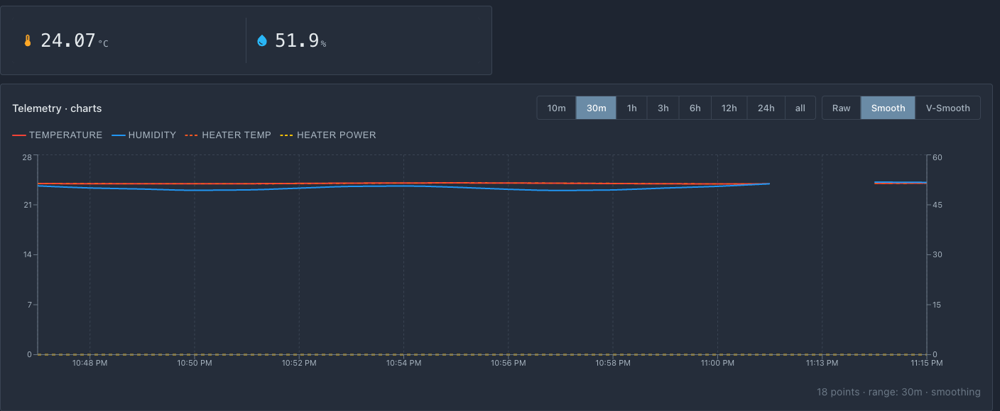

# Sensores

Nesta página você conecta dois sensores e envia seus dados ao portal. Primeiro SHT31 (clima do gabinete), depois termistor (temperatura do aquecedor). Este é o passo "obtemos dados" antes de adicionar a lógica de controle.

O princípio de trabalho com o núcleo é simples: seu código em `loop()` escreve leituras frescas nos campos `s_link.telemetry.*`, e a fachada publica-os automaticamente na nuvem a cada `telemetryPeriodMs` da `Config`. Nenhuma necessidade de chamar a publicação manualmente.

## Campos de telemetria

Para nosso gabinete, usamos três campos (índice `[0]` — primeira e única câmera):

| Campo | O que armazena | Flag em Config |
|------|------------|---------------|
| `s_link.telemetry.airTempC[0]` | temperatura do ar, °C | `hasAirTemp` |
| `s_link.telemetry.airHumidityPct[0]` | umidade do ar, % | `hasAirHumidity` |
| `s_link.telemetry.heaterTempC[0]` | temperatura do aquecedor, °C | `hasHeaterTemp` |

Esses três sinalizadores são ligados aqui mesmo, no `Config` (veja a listagem completa no fim do capítulo). O sinalizador diz ao portal e ao app que o dispositivo tem tal sensor: sem ele a célula não aparece no cartão.

## Regra: código de sensor não deve bloquear loop()

A fachada `idryer-core` serve Wi-Fi e MQTT no mesmo `loop()`. Portanto, ao ler sensores, você não pode chamar `delay()` — uma pausa quebra a sessão de rede. O sensor é consultado por um temporizador, e o valor pronto é simplesmente lido. Os drivers prontos do ecossistema já são estruturados assim.

## Passo 1. SHT31: clima do gabinete

Você não precisa escrever o driver SHT31 do zero — a classe pronta `Sht31ClimateSensor` está no exemplo deste capítulo, [example/09-cabinet](https://github.com/pavluchenkor/Build-Your-Own-iDryer/tree/main/example/09-cabinet). Ele usa a biblioteca `robtillaart/SHT31` e lê o sensor sem bloqueio.

1. Adicione a biblioteca SHT31 em `lib_deps` do seu `platformio.ini`:

    ```ini
    lib_deps =
        robtillaart/SHT31 @ ^0.5.0
    ```

2. Copie para sua pasta `src/` quatro arquivos do driver:

    ```bash
    git clone https://github.com/pavluchenkor/Build-Your-Own-iDryer.git ~/byo-idryer
    cp ~/byo-idryer/example/09-cabinet/src/{Sht31ClimateSensor.h,Sht31ClimateSensor.cpp,IClimateSensor.h,sensor_reading.h} src/
    ```

3. Conecte o sensor por I2C (veja [Esquema de conexão](03-wiring.md)) e leia-o em `src/main.cpp`:

```cpp
#include <Wire.h>
#include <iDryer.h>
#include "Sht31ClimateSensor.h"

static Sht31ClimateSensor s_climate(&Wire);
static bool               s_climateOk = false;

void setup() {
    Serial.begin(115200);
    Wire.begin(8, 9);                 // SDA, SCL — pinos da sua placa
    s_climateOk = s_climate.begin();  // encontra automaticamente o endereço 0x44 ou 0x45
    s_link.begin();
    // Dispositivo desvinculado no portal: apagar o segredo e aguardar nova vinculação.
    s_link.onCommand("revoke", [](JsonObjectConst) { s_link.handleRevoke(); });
}

void loop() {
    s_link.loop();

    if (s_climateOk) {
        s_climate.tick(millis());
        SensorReading r = s_climate.get();
        if (r.ok) {
            s_link.telemetry.airTempC[0]       = r.temperature;
            s_link.telemetry.airHumidityPct[0] = r.humidity;
        }
    }
}
```

O driver entrega um instantâneo das leituras pela estrutura `SensorReading` de `sensor_reading.h`:

```cpp
struct SensorReading {
    float    temperature = NAN;   // °C, NAN se não há valor
    float    humidity    = NAN;   // % RH, NAN se não há valor
    float    pressure    = NAN;   // hPa, para futuros sensores
    uint32_t ts_ms       = 0;     // millis() no momento da leitura
    bool     ok          = false; // true, se temperatura e umidade são válidas
    int      err         = 0;     // código de erro, 0 — sem erro
};
```

Após flashear, o portal mostrará temperatura e umidade do gabinete — este é o primeiro feedback do dispositivo.

## Passo 2. Termistor: temperatura do aquecedor

Não tenho uma classe pronta de termistor para ESP32, então escrevemos a leitura nós mesmos diretamente em `src/main.cpp`. O termistor está conectado ao pino ADC através de um conversor de tensão (veja [Esquema de conexão](03-wiring.md)): o controlador mede a tensão no ponto central, por ela calcula a resistência do termistor, depois a temperatura.

```cpp
#include <math.h>

static const int   THERM_PIN  = 2;         // pino ADC
static const float SERIES_R   = 4700.0f;   // resistor divisor, Ω
static const float NOMINAL_R  = 100000.0f; // resistência do termistor a 25 °C, Ω
static const float NOMINAL_T  = 25.0f;     // °C
static const float BETA       = 3950.0f;   // coeficiente B do termistor

// Retorna a temperatura do aquecedor em °C.
static float readHeaterTempC() {
    int   raw = analogRead(THERM_PIN);          // 0..4095 em ESP32
    float v   = (float)raw / 4095.0f;           // fração da escala completa
    float r   = SERIES_R * (1.0f - v) / v;      // resistência do termistor, Ω
    // Equação de Steinhart–Hart na forma do parâmetro B — veja a Wikipédia:
    // https://en.wikipedia.org/wiki/Steinhart%E2%80%93Hart_equation
    float tK  = 1.0f / (1.0f / (NOMINAL_T + 273.15f) + logf(r / NOMINAL_R) / BETA);
    return tK - 273.15f;
}
```

Em `loop()` escreva o resultado na telemetria perto da leitura SHT31:

```cpp
s_link.telemetry.heaterTempC[0] = readHeaterTempC();
```

!!! warning "Esta é leitura simplificada — ajuste os parâmetros para seu termistor"
    Constantes `NOMINAL_R` e `BETA` dependem do termistor específico — pegue-as de sua folha de dados (termistor doméstico comum — Genérico 3950, `100 kΩ`). A fórmula divisor corresponde ao esquema de [Esquema de conexão](03-wiring.md): termistor para `3.3V`, resistor para `GND`. Com outro roteamento a fórmula muda. ADC em ESP32 é não-linear, então para medições precisas as leituras são calibradas — nos controladores iDryer em série uma tabela de termistor é usada (biblioteca `Thermistor`).

Verificação de termistor com multímetro — [Verificação de termistor](../06-practical-guides/02-checking-thermistor.md).

## Passo 3. Sem sensores à mão? Modo demo

Dá para percorrer o caminho até o cartão sem hardware: as leituras são calculadas por um modelo do gabinete. Copie o arquivo `demo_sensors.h` do mesmo exemplo:

```bash
cp ~/byo-idryer/example/09-cabinet/src/demo_sensors.h src/
```

e adicione ao `platformio.ini` a flag de build:

```ini
build_flags =
    -DDEMO_SENSORS=1
```

Ambos os ramos ficam escondidos atrás de uma única função, e o `loop()` não sabe de onde vieram os valores:

```cpp
static void readSensors() {
#ifdef DEMO_SENSORS
    demoSensors(s_link.telemetry);
#else
    // leitura do SHT31 e do termistor — como acima
#endif
}
```

O modelo se comporta como um gabinete de verdade: o ambiente oscila lentamente em torno de `24 °C`, o aquecedor ligado esquenta o ar, o desligado deixa esfriar, no aquecimento a umidade cai. A potência de aquecimento o modelo lê da telemetria, por isso a lógica do capítulo [Controle de aquecimento](07-heating-control.md) vê a resposta e a histerese funciona. As capturas de tela desta seção foram feitas exatamente assim.

Para o dispositivo em operação a flag não é usada: aí é compilado o ramo com os sensores de verdade.

## Completo `src/main.cpp` após este capítulo

Abaixo — o arquivo inteiro. Novas linhas em relação ao capítulo anterior são marcadas `// ← capítulo 5`; o resto não mudou.

??? note "O que foi — `src/main.cpp` após o capítulo 4"

    ```cpp
    #include <iDryer.h>

    static const iDryer::Config CFG = {
        .deviceType        = iDryer::DeviceType::Unknown,   // dispositivo próprio: o cartão é montado pelo manifesto
        .unitsCount        = 1,
        .telemetryPeriodMs = 5000,
        .statusPeriodMs    = 10000,
        .hardwareVersion   = "1.0",
        .firmwareVersion   = "0.1.0",
        .model             = "DIY Storage Cabinet",
    };
    static iDryer::Link s_link(CFG);

    void setup() {
        Serial.begin(115200);
        s_link.begin();
        // Dispositivo desvinculado no portal: apagar o segredo e aguardar nova vinculação.
        s_link.onCommand("revoke", [](JsonObjectConst) { s_link.handleRevoke(); });
    }

    void loop() {
        s_link.loop();
    }
    ```

```cpp
#include <iDryer.h>
#include <Wire.h>                  // ← capítulo 5
#include <math.h>                  // ← capítulo 5
#include "Sht31ClimateSensor.h"    // ← capítulo 5
#include "demo_sensors.h"    // ← capítulo 5: leituras sem sensores (-DDEMO_SENSORS=1)

static const iDryer::Config CFG = {
    .deviceType        = iDryer::DeviceType::Unknown,   // dispositivo próprio: o cartão é montado pelo manifesto
    .unitsCount        = 1,
    .hasAirTemp        = true,     // ← capítulo 5
    .hasAirHumidity    = true,     // ← capítulo 5
    .hasHeaterTemp     = true,  // ← capítulo 5
    .telemetryPeriodMs = 5000,
    .statusPeriodMs    = 10000,
    .hardwareVersion   = "1.0",
    .firmwareVersion   = "0.1.0",
    .model             = "DIY Storage Cabinet",
};
static iDryer::Link s_link(CFG);

// ← capítulo 5: sensor de clima SHT31
static Sht31ClimateSensor s_climate(&Wire);
static bool               s_climateOk = false;

// ← capítulo 5: termistor do aquecedor
static const int   THERM_PIN  = 2;
static const float SERIES_R   = 4700.0f;
static const float NOMINAL_R  = 100000.0f;
static const float NOMINAL_T  = 25.0f;
static const float BETA       = 3950.0f;

static float readHeaterTempC() {
    int   raw = analogRead(THERM_PIN);
    float v   = (float)raw / 4095.0f;
    float r   = SERIES_R * (1.0f - v) / v;
    float tK  = 1.0f / (1.0f / (NOMINAL_T + 273.15f) + logf(r / NOMINAL_R) / BETA);
    return tK - 273.15f;
}

// ← capítulo 5: sensores ou, com -DDEMO_SENSORS=1, o modelo do gabinete
static void readSensors() {
#ifdef DEMO_SENSORS
    demoSensors(s_link.telemetry);
#else
    if (s_climateOk) {
        s_climate.tick(millis());
        SensorReading r = s_climate.get();
        if (r.ok) {
            s_link.telemetry.airTempC[0]       = r.temperature;
            s_link.telemetry.airHumidityPct[0] = r.humidity;
        }
    }
    s_link.telemetry.heaterTempC[0] = readHeaterTempC();
#endif
}

void setup() {
    Serial.begin(115200);
    Wire.begin(8, 9);                 // ← capítulo 5  (SDA, SCL — pinos da sua placa)
    s_climateOk = s_climate.begin();  // ← capítulo 5
    s_link.begin();
    // Dispositivo desvinculado no portal: apagar o segredo e aguardar nova vinculação.
    s_link.onCommand("revoke", [](JsonObjectConst) { s_link.handleRevoke(); });
}

void loop() {
    s_link.loop();

    readSensors();   // ← capítulo 5
}
```

## Verificação de resultado


*Leituras no cartão e o gráfico de telemetria. A temperatura do aquecedor vai como uma linha separada no gráfico. O menu no rodapé da página ainda está vazio — o próximo capítulo cuida dele.*

Após este passo, o portal deve exibir três valores:

- temperatura do ar no gabinete;
- umidade no gabinete;
- temperatura do aquecedor.

Se as leituras "flutuam" ou são claramente incorretas:

- verifique terra comum e roteamento (interferência de fios de potência) — [Erros de fiação](../08-common-mistakes/03-wiring-mistakes.md);
- verifique o valor do resistor divisor e tipo do termistor;
- certifique-se de que SHT31 responde em I2C (endereço correto e linhas).

Diagnóstico "sensor mostra bobagem" — [Verificação de termistor](../06-practical-guides/02-checking-thermistor.md) e [Erros típicos](../08-common-mistakes/01-overview.md).

## O que vem a seguir

Dados de sensores existem. Agora descrevemos as configurações do dispositivo (temperatura-alvo, histerese) em [Menu em YAML](06-menu.md), para que possam ser alteradas do portal e armazenadas na memória.
