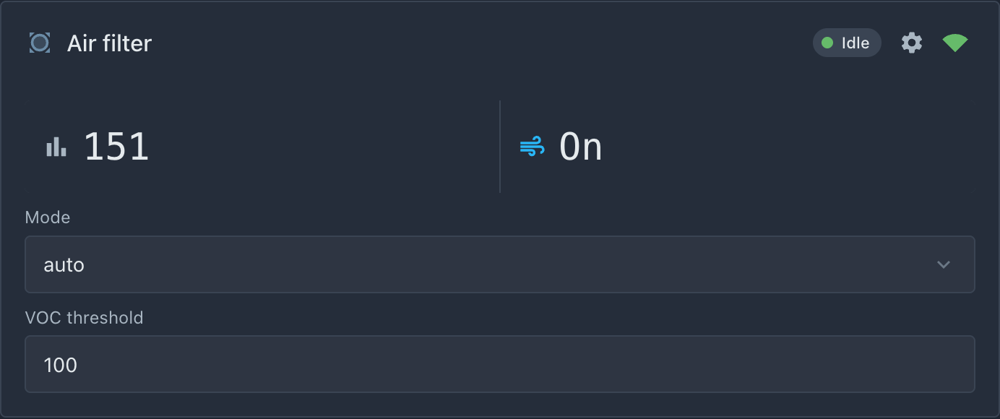
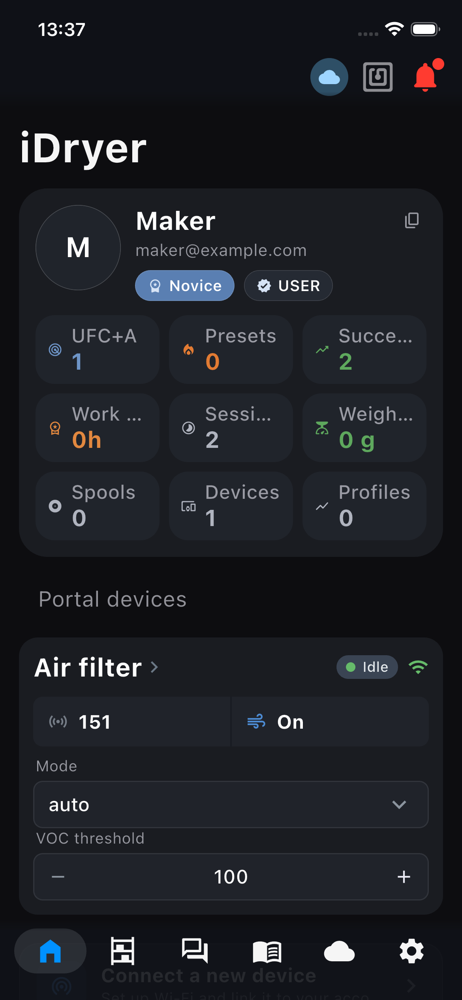
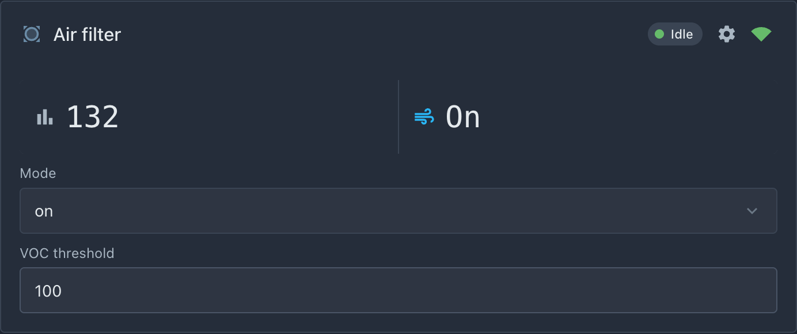

# Lógica de automação

Conectamos tudo: o sensor decide, ventilador gira, portal controla.

## 1. Estado e configurações

No início de `src/main.cpp`:

```cpp
#include <Preferences.h>

static const int FAN_PIN = 4;

enum class FilterMode : uint8_t { Auto, On, Off };
static FilterMode g_mode      = FilterMode::Auto;
static int32_t    g_threshold = 150;   // índice VOC para ativar
static bool       g_fanOn     = false;

static Preferences s_prefs;
```

`Preferences` (NVS) — memória não-volátil do ESP32: modo e limiar sobrevivem a reinicialização.

## 2. Controle do ventilador

Concentramos todo ligar e desligar em uma função `setFan`. Ela recebe um argumento `on` — estado desejado: `true` = ligar, `false` = desligar. Mais abaixo no código sempre chamamos `setFan(true)` / `setFan(false)`, e ela faz toda a rotina: move o pino, lembra o estado e avisa o portal.

```cpp
static void setFan(bool on) {      // on — argumento: true = ligar, false = desligar
    if (g_fanOn == on) return;     // já no estado desejado — nada fazer
    g_fanOn = on;                  // lembramos novo estado em variável global
    digitalWrite(FAN_PIN, on ? HIGH : LOW);  // ligamos/desligamos chave do ventilador fisicamente

    // Comunicamos ao núcleo: fanOn[0] — campo de telemetria do dicionário
    // (apareceu de hasFan = true; [0] — nossa única unidade, como no capítulo 5).
    // Daqui vai para nuvem e célula "Ventilador" do cartão.
    s_link.telemetry.fanOn[0] = on;

    // Mudança de estado — razão para enviar telemetria já, não esperar o período.
    s_link.publishTelemetryNow();
}
```

`publishTelemetryNow()` faz a resposta instantânea: clicou no portal — em um segundo o cartão mostra o estado confirmado. Confirmado de verdade: o portal iDryer nunca "adivinha" o estado, mostra o que o dispositivo realmente mandou.

## 3. Automática com histerese

Se ligarmos o ventilador exatamente no limiar, perto do limiar ele vai oscilar entre lig/deslig. Resolve-se com uma margem:

```cpp
static void tickAutoLogic() {
    if (g_mode == FilterMode::On)  { setFan(true);  return; }
    if (g_mode == FilterMode::Off) { setFan(false); return; }

    // Auto: ligamos no limiar, desligamos 20 pontos abaixo.
    if (g_vocIndex < 0) return;                      // sensor ainda silencioso
    if (!g_fanOn && g_vocIndex >= g_threshold)      setFan(true);
    if ( g_fanOn && g_vocIndex <= g_threshold - 20) setFan(false);
}
```

Chamaremos `tickAutoLogic()` ali mesmo onde lemos o sensor — em `loop()` com timer de segundo. Este é o `loop()` do capítulo 5, nele adicionamos uma linha. Completamente agora fica assim:

```cpp
void loop() {
    s_link.loop();                        // rede, telemetria, comandos — sempre primeiro

    uint32_t now = millis();
    if (now - s_lastReadMs >= 1000) {     // uma vez por segundo:
        s_lastReadMs = now;
        readVocSensor();                  //   lemos VOC (capítulo 5)
        tickAutoLogic();                  //   e logo decidimos sobre ventilador
    }
}
```

Ordem dentro do bloco de segundo não é acidental: primeiro leitura fresca do sensor, depois decisão por ela.

## 4. Callbacks do portal

Aquelas mesmas funções que prometemos no [capítulo 6](06-card.md):

```cpp
static void onModeSelected(const char* opt) {
    if      (strcmp(opt, "auto") == 0) g_mode = FilterMode::Auto;
    else if (strcmp(opt, "on")   == 0) g_mode = FilterMode::On;
    else                               g_mode = FilterMode::Off;
    s_prefs.putUChar("mode", (uint8_t)g_mode);
    tickAutoLogic();   // aplicamos já, não esperar próximo tick
}

static void onThresholdChanged(float v) {
    g_threshold = (int32_t)v;
    s_prefs.putInt("thr", g_threshold);
}
```

Estas funções **substituem** os esboços do capítulo 6 — delete as versões vazias.

Note o que **não está** neste código: análise de MQTT, tópicos, comandos JSON. O usuário escolheu `on` na lista no portal → o núcleo recebeu o comando, verificou e chamou `onModeSelected("on")`. Toda a mecânica de transporte é responsabilidade do núcleo.

## 5. setup() final

Resta adicionar em `setup()` duas coisas: carregamento das configurações salvas em NVS (no início, para a lógica já trabalhar com elas) e configuração do pino do ventilador. O `setup()` completo após este capítulo fica assim:

```cpp
void setup() {
    Serial.begin(115200);

    // Configurações de NVS: o que usuário escolhia em tempos anteriores.
    s_prefs.begin("filter");   // abrir namespace "filter" em NVS
    g_mode      = (FilterMode)s_prefs.getUChar("mode", (uint8_t)FilterMode::Auto);
    g_threshold = s_prefs.getInt("thr", 150);
    // Segundos argumentos getUChar/getInt — valores padrão: retornarão
    // no primeiro lançamento, quando ainda nada está salvo em NVS.

    pinMode(FAN_PIN, OUTPUT);  // pino chave do ventilador — para saída

    s_link.begin();
    // Dispositivo desvinculado no portal: apagar o segredo e aguardar nova vinculação.
    s_link.onCommand("revoke", [](JsonObjectConst) { s_link.handleRevoke(); });
    initVocSensor();

    // Telemetria: seu campo vocIndex (capítulo 5).
    s_link.onTelemetryPublish([](JsonObject doc) {
        if (g_vocIndex >= 0) {
            doc["units"][0]["vocIndex"] = g_vocIndex;
        }
    });

    // Cartão: sensor + órgãos de controle (capítulo 6).
    s_link.card().sensor("voc", "VOC index", "", "units[0].vocIndex");

    static const char* kModes[] = { "auto", "on", "off" };
    s_link.card().select("mode", "Mode", kModes, 3, [](const char* opt) {
        onModeSelected(opt);
    });

    s_link.card().number("threshold", "VOC threshold", 100, 400, 10, "", [](float v) {
        onThresholdChanged(v);
    });

    // Layout (capítulo 6, opcional).
    s_link.card().layoutRow("voc", "fan");
    s_link.card().layoutRow("mode", "threshold");
}
```

## 6. Verificação de cenários

| Ação | Esperado |
|---|---|
| Modo `auto`, soprar no sensor | VOC cresce, no limiar ventilador liga, cartão mostra "Lig" |
| Ar limpou | abaixo de limiar−20 ventilador desliga sozinho |
| Modo `on` do portal | ventilador gira independente de VOC |
| Modo `off` do portal | ventilador parado, VOC continua mostrando |
| Reiniciar placa | modo e limiar foram salvos |

Assim fica ao vivo. Limiar `150`, o índice chegou até ele — o ventilador ligou sozinho:


*Modo `auto`: índice `151` com limiar `150` — ventilador ligado.*


*O aplicativo mostra o mesmo estado: o valor subiu, o ventilador está funcionando.*

O modo manual se sobrepõe à automação: `Mode` → `on`, e o ventilador gira mesmo quando o ar já está limpo:


*Modo `on`, índice `132` — abaixo do limiar, mas o ventilador funciona: o comando do portal é mais importante que a automação.*

## 7. Código final: src/main.cpp completamente

Todo o código dos capítulos 4–7, montado em um arquivo. Se algo não coincidir com o seu — compare com esta listagem.

```cpp
// ============================================================
// Filtro de ar inteligente em idryer-core.
// SGP40 (VOC) + ventilador pelo MOSFET, modo auto/manual,
// controle e cartão no portal através de manifesto do cartão.
// ============================================================

#include <iDryer.h>
#include <Wire.h>
#include <Adafruit_SGP40.h>
#include <Preferences.h>
#include "demo_voc.h"                 // índice sem sensor (-DDEMO_VOC=1)

// ── Pinos ────────────────────────────────────────────────────
static const int FAN_PIN = 4;         // porta MOSFET do ventilador
// SDA=8, SCL=9 — especificados em Wire.begin() abaixo

// ── Passaporte do dispositivo (capítulo 4) ───────────────────
static const iDryer::Config CFG = {
    .deviceType        = iDryer::DeviceType::Unknown, // dispositivo não-padrão
    .unitsCount        = 1,
    .hasFan            = true,        // única habilidade do dicionário
    .telemetryPeriodMs = 5000,
    .statusPeriodMs    = 10000,
    .hardwareVersion   = "1.0",
    .firmwareVersion   = "0.1.0",
    .model             = "DIY Air Filter",
};

static iDryer::Link s_link(CFG);

// ── Estado (capítulo 7) ─────────────────────────────────────
enum class FilterMode : uint8_t { Auto, On, Off };
static FilterMode g_mode      = FilterMode::Auto;
static int32_t    g_threshold = 150;  // índice VOC para ativar
static bool       g_fanOn     = false;

static Preferences s_prefs;           // NVS: configurações sobrevivem reinicialização

// ── Sensor VOC (capítulo 5) ────────────────────────────────────
static Adafruit_SGP40 s_sgp;
static int32_t g_vocIndex = -1;       // -1 = sem dados ainda

static void initVocSensor() {
#ifndef DEMO_VOC
    Wire.begin(/*SDA=*/8, /*SCL=*/9);
    if (!s_sgp.begin()) {
        Serial.println("[VOC] SGP40 not found, check wiring");
    }
#endif
}

// Sensor ou, com -DDEMO_VOC=1, modelo de ar (capítulo 5).
static void readVocSensor() {
#ifdef DEMO_VOC
    g_vocIndex = demoVocIndex(g_fanOn);
#else
    // Índice: ~100 = ar normal, maior = mais sujo (máx 500).
    g_vocIndex = s_sgp.measureVocIndex();
#endif
}

// ── Ventilador (capítulo 7) ────────────────────────────────────
static void setFan(bool on) {         // on: true = ligar, false = desligar
    if (g_fanOn == on) return;        // já no estado desejado
    g_fanOn = on;
    digitalWrite(FAN_PIN, on ? HIGH : LOW);
    s_link.telemetry.fanOn[0] = on;   // campo do dicionário → nuvem → cartão
    s_link.publishTelemetryNow();     // mudança de estado — publicamos já
}

// ── Automática com histerese (capítulo 7) ─────────────────────
static void tickAutoLogic() {
    if (g_mode == FilterMode::On)  { setFan(true);  return; }
    if (g_mode == FilterMode::Off) { setFan(false); return; }

    // Auto: ligamos no limiar, desligamos 20 pontos abaixo.
    if (g_vocIndex < 0) return;       // sensor ainda silencioso
    if (!g_fanOn && g_vocIndex >= g_threshold)      setFan(true);
    if ( g_fanOn && g_vocIndex <= g_threshold - 20) setFan(false);
}

// ── Callbacks de comandos do portal (capítulos 6–7) ────────────────────
static void onModeSelected(const char* opt) {
    if      (strcmp(opt, "auto") == 0) g_mode = FilterMode::Auto;
    else if (strcmp(opt, "on")   == 0) g_mode = FilterMode::On;
    else                               g_mode = FilterMode::Off;
    s_prefs.putUChar("mode", (uint8_t)g_mode);
    tickAutoLogic();                  // aplicamos já
}

static void onThresholdChanged(float v) {
    g_threshold = (int32_t)v;
    s_prefs.putInt("thr", g_threshold);
}

// ── setup: configurações, rede, sensor, cartão ────────────────
void setup() {
    Serial.begin(115200);

    // Configurações de NVS (segundos argumentos — padrões do primeiro lançamento).
    s_prefs.begin("filter");
    g_mode      = (FilterMode)s_prefs.getUChar("mode", (uint8_t)FilterMode::Auto);
    g_threshold = s_prefs.getInt("thr", 150);

    pinMode(FAN_PIN, OUTPUT);

    s_link.begin();                   // Wi-Fi, MQTT, vinculação — tudo dentro
    // Dispositivo desvinculado no portal: apagar o segredo e aguardar nova vinculação.
    s_link.onCommand("revoke", [](JsonObjectConst) { s_link.handleRevoke(); });
    initVocSensor();

    // Telemetria: adicionamos nosso campo vocIndex (capítulo 5).
    s_link.onTelemetryPublish([](JsonObject doc) {
        if (g_vocIndex >= 0) {
            doc["units"][0]["vocIndex"] = g_vocIndex;
        }
    });

    // Cartão: sensor + órgãos de controle (capítulo 6).
    s_link.card().sensor("voc", "VOC index", "", "units[0].vocIndex");

    static const char* kModes[] = { "auto", "on", "off" };
    s_link.card().select("mode", "Mode", kModes, 3, [](const char* opt) {
        onModeSelected(opt);
    });

    s_link.card().number("threshold", "VOC threshold", 100, 400, 10, "", [](float v) {
        onThresholdChanged(v);
    });

    // Layout de fábrica do cartão (capítulo 6, opcional).
    s_link.card().layoutRow("voc", "fan");
    s_link.card().layoutRow("mode", "threshold");
}

// ── loop: rede sempre, sensor e lógica uma vez por segundo ────────
static uint32_t s_lastReadMs = 0;

void loop() {
    s_link.loop();                    // rede, telemetria, comandos — sempre primeiro

    uint32_t now = millis();
    if (now - s_lastReadMs >= 1000) {
        s_lastReadMs = now;
        readVocSensor();              // leitura fresca…
        tickAutoLogic();              // …e logo decisão por ela
    }
}
```
